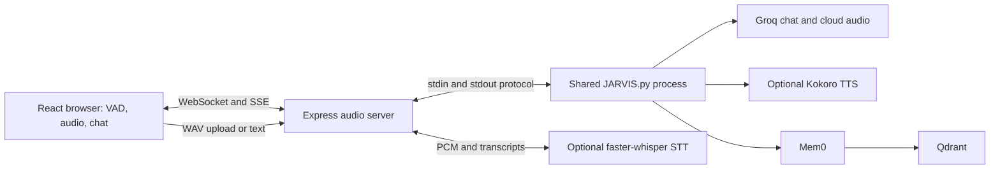
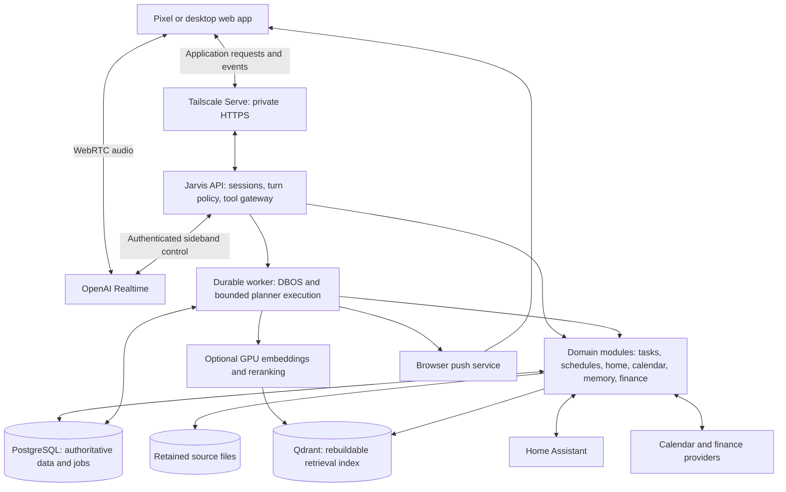
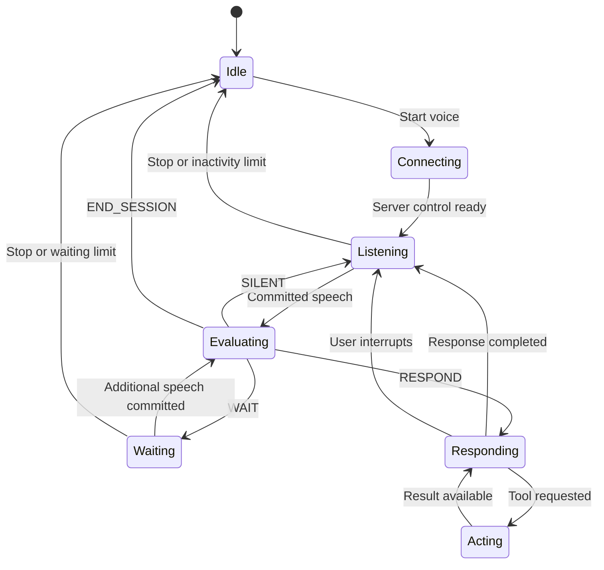

# Jarvis personal agent upgrade PRD

Jarvis should become a voice-first personal system that reliably manages everyday commitments and retrieves useful personal context. Its voice model provides conversation, personality, and intent interpretation. Durable services own the data and execute actions. Replacing a model must not require migrating tasks, schedules, or personal history.

This is a complete proposed specification for product and engineering review. The architecture recommendations are ready for a decision; performance targets and candidate-model quality still require the implementation experiments defined below. Source documentation and the local working tree were reviewed on September 10, 2026. No production deployment, paid API benchmark, bank connection, or device-control test is represented as completed.

Start with the [decision brief](/home/davin/jarvis/docs/JARVIS_UPGRADE_DECISIONS.md) for the recommended choices and the reasons behind them. Within this document, use [current architecture](#2-existing-architecture-and-upgrade-implications), [voice behavior](#5-voice-experience-and-response-policy), [memory](#11-memory-context-and-personalized-retrieval), [budget](#14-model-selection-and-operating-budget), [acceptance tests](#16-acceptance-criteria-and-evaluation-plan), [alternatives](#17-architecture-choices-and-alternatives), and [delivery plan](#18-implementation-sequence-and-migration) as entry points.

## 1. Product scope and confirmed constraints

The first technical milestone is **Pixel voice → OpenAI Realtime → Jarvis task API → PostgreSQL**, with a web interface showing the same committed task. The first daily-use release adds dependable reminders, useful task views, and recovery after connection or process failures. Home control follows, then memory and context, then finance and more capable delegated work.

| Constraint | Status | Consequence |
|---|---|---|
| Pixel foreground web app first | Confirmed | Open the app and start a voice session deliberately. Native Android background voice is a later release. |
| Home PC hosting | Confirmed | Docker Compose deployment with persistent storage and automatic process restart. |
| RTX 3080 | Confirmed; read-only hardware query reports 10,240 MiB VRAM | Use it first for embeddings and reranking. GPU availability must not determine whether task APIs or reminders work. |
| Approximately $150/month API spending | Confirmed; expandable if useful | Meter all model usage, expose projections, and enforce a configurable application budget. Expansion is a deliberate setting change. |
| Local task database is authoritative | Confirmed | Task applications and agents use the same domain API. |
| Silence is an intentional outcome | Confirmed | Automatic turn detection and permission to speak are separate decisions. |
| Private remote access through Tailscale | Specified | Use a private HTTPS origin; keep databases and application internals off public interfaces. |
| One owner, multiple personal devices | Proposed initial operating scope | Isolate sessions and device audio even though the task and memory data are shared. |
| America/Chicago home time zone | Proposed from the current environment | Store an explicit owner preference; never derive reminder semantics from a container's local clock. |
| Google Calendar as first external calendar | Proposed, not an observed account connection | Start with a read-only adapter. The core remains useful without a connected calendar. |

The inspected WSL environment reports about 23 GiB RAM. Filesystem free space is a virtual-disk observation, not proof of physical Windows disk capacity. Actual GPU contention, available physical storage, PC sleep behavior, Home Assistant installation, calendar accounts, and bank compatibility remain deployment inputs.

## 2. Existing architecture and upgrade implications

The repository is a working voice-assistant prototype. At review, HEAD was `35d4b1e` dated February 21, 2026, with existing uncommitted changes in the voice middleware, memory configuration, UI, TLS setup, and Compose configuration. The analysis below describes the working files rather than assuming the README or HEAD alone is current.



| Component | Observed implementation | Implication for the upgrade |
|---|---|---|
| Browser | React 18 / Create React App, with most interaction state in a 899-line [App.js](/home/davin/jarvis/client/src/App.js:108). Voice, playback, transcript, settings, and connection state are intertwined. | Reuse visual components and interaction lessons; extract a session controller and feature-specific views. |
| Transport | Browser builds separate `:3000` HTTP/WS addresses. Express relays streaming PCM, broadcasts text/audio, and serves audio files. [Client URLs](/home/davin/jarvis/client/src/App.js:9), [broadcast functions](/home/davin/jarvis/backend/audio-server/server.js:58). | Replace the bespoke audio transport for the Realtime path. Use one HTTPS application origin and a separate private server control connection to Realtime. |
| Conversation | One global `ContextManager` maintains recent messages and a rolling summary in process memory. [Context implementation](/home/davin/jarvis/backend/JARVIS.py:21), [singleton](/home/davin/jarvis/backend/JARVIS.py:218). | Establish persistent conversation IDs and separate device/session state. A process restart must not erase accepted work. |
| Model | Chat generation calls Groq's `openai/gpt-oss-120b` directly, with memory searched before every response. [Chat path](/home/davin/jarvis/backend/JARVIS.py:413). | Replace provider calls behind model profiles. Retrieve deeper memory only when relevant. |
| Turn handling | Local VAD and EOU logic finalize speech. Python then calls the model; there is no application-level silent outcome. [Browser VAD](/home/davin/jarvis/client/src/App.js:621), [processing](/home/davin/jarvis/backend/JARVIS.py:537). | Build an explicit turn policy and define silence, waiting, responding, and ending a session. |
| Interruption | The stdin reader performs chat generation synchronously before reading the next control message; its interrupt path explicitly cancels Kokoro generation. The browser also stops playback locally. [Reader](/home/davin/jarvis/backend/JARVIS.py:590), [browser interruption](/home/davin/jarvis/client/src/App.js:439). | Local silence can occur before server work stops. New design must distinguish stopping speech, cancelling a response, and cancelling an action/job. |
| Memory | Mem0 uses `all-MiniLM-L6-v2`, 384-dimensional vectors, one Qdrant collection, and hard-coded owner `davin`. Separate user/assistant searches return strings, losing source IDs in the context result. [Configuration](/home/davin/jarvis/backend/memory.py:23), [retrieval](/home/davin/jarvis/backend/memory.py:130). | Preserve the existing collection as migration input. Introduce source references, versioned assertions, owner filtering, and retrieval records. |
| Background work | Memory extraction and TTS use daemon threads. No durable application job queue is present. [Memory work](/home/davin/jarvis/backend/memory.py:196), [TTS dispatch](/home/davin/jarvis/backend/JARVIS.py:406). | Store accepted work before acknowledgement and recover interrupted processing. |
| Persistent data | Compose persists Qdrant and uploaded audio. There is no application PostgreSQL database or canonical transcript/event ledger. [Compose](/home/davin/jarvis/docker-compose.yml:1). | Retained WAV files and derived facts do not establish a complete replayable conversation history. Do not promise to reconstruct missing transcripts. |
| Isolation and access | The inspected server uses unrestricted CORS and shared WS/SSE broadcasts; no application authentication layer is present. [HTTP setup](/home/davin/jarvis/backend/audio-server/server.js:195). | Audio must be private to its originating session. Server-side identity must govern every domain request. |
| Deployment | A CUDA image combines Node, Python, audio tools, and model dependencies. Compose publishes ports 3000, 9001, 6333, 8080, and 443. Port 9001 is annotated as also used by glasses transcription. [Backend image](/home/davin/jarvis/backend/Dockerfile:1), [Compose](/home/davin/jarvis/docker-compose.yml:1). | Separate GPU processing from core services. Preserve the optional STT endpoint until its external consumer is inventoried and migrated. |
| Validation | The committed UI test still checks for “learn react”; backend package testing is a placeholder. [UI test](/home/davin/jarvis/client/src/App.test.js:1), [package scripts](/home/davin/jarvis/backend/audio-server/package.json:1). | Build product acceptance tests around actual voice/action behavior, reconnects, and recovery. |

The [June troubleshooting note](/home/davin/jarvis/troubleshooting-backend-empty-response.md:1) documents an empty-response incident. The current server can select HTTPS on port 3000 while the client derives its protocol from the page, making HTTP/HTTPS mismatch a plausible failure mode. This is a code-based hypothesis, not a diagnosis of the historical deployment. A single origin and explicit readiness checks remove that class of ambiguity from the new path.

## 3. Outcomes, release boundaries, and non-goals

Success means the owner uses Jarvis to capture and complete real commitments, trusts reminder state across restarts, and finds its conversation timing comfortable. Capability count alone is not a success measure.

| Release | User-visible outcome | Included |
|---|---|---|
| R0: vertical slice | “Add milk” creates one durable task and immediately displays it. | Foreground Pixel voice, text fallback, task create/list/complete, authenticated API, PostgreSQL, initial silence/interruption controller. |
| R1: daily-use foundation | Jarvis handles daily task capture and delivers reminders with the app closed. | Task editing/search, Inbox/Today/Week, one-off and simple recurring reminders, Web Push, durable execution, usage controls, session recovery, export/backup. Read-only calendar integration is an optional R1 adapter. |
| R2: home control | Jarvis controls supported lights/scenes and reports actual device state. | Home Assistant adapter, entity aliases, state confirmation, controlled temperature operations, optional simple event reminders. |
| R3: memory and context | “Remember this” and source-backed recall work reliably. | Raw-event ingestion, legacy memory import, derived assertions, hybrid retrieval, local reranker, context broker, correction/deletion controls, relevance feedback. |
| R4: richer personal work | Jarvis performs bounded research, reviews, and finance analysis in the background. | Small/medium/large planner profiles, multi-step jobs, read-only finance imports and summaries, expanded project/place/person views, more triggers and selected capture connectors. |
| Later | Additional access and capture surfaces | Native Android voice, chosen conversation recording, location triggers, broader integrations, personalized reranker training after sufficient evidence. |

R0 is a technical milestone. R1 is the first release that should replace daily task/reminder habits. The thin router, durable worker, and action checks are foundations in R1; advanced planning remains later.

Initial non-goals are continuous ambient recording, background microphone reliability in a browser, a household multi-user product, arbitrary agent-generated HTML, autonomous payments or trading, general remote shell access, Kubernetes, and a complete replacement for every calendar or finance application. Tasks may be captured offline later; the first release shows unsent text explicitly and never implies an offline server write succeeded.

## 4. Recommended target architecture

Use a **modular Python application with a separate durable worker**, a React/TypeScript web client, PostgreSQL, and an optional Python GPU service. This keeps the existing Python ecosystem useful while replacing the process-wide chat loop. Domain modules have explicit interfaces and ownership even when they run in one API process. Split them into separate containers only when isolation, resource demand, or deployment cadence warrants it.



Media travels between the browser and OpenAI. Task execution, authority, and durable state remain on the home server. OpenAI recommends WebRTC for browser/mobile connections and provides a server connection to the same session for tool handling.[^1][^2] The term “realtime gateway” here means session setup and server control; it does not imply that every audio frame passes through the PC.

### 4.1 Runtime and code boundaries

| Boundary | Proposed implementation | Responsibility |
|---|---|---|
| Web client | React + TypeScript + Vite | Voice controls, task/schedule views, source cards, job progress, Web Push registration. |
| API | FastAPI, Pydantic, SQLAlchemy, Alembic | HTTP/WS contracts, identity, session lifecycle, tool validation, domain commands and reads. |
| Worker | DBOS Python with PostgreSQL | Durable reminders, ingestion, projection updates, retries, later planner workflows. |
| Domain layer | Python modules shared by API and worker | Business rules; no dependency on any particular model API. |
| Retrieval processing | Separately managed Python process/container | Embeddings, sparse encoding, cross-encoder scoring, later training. |
| Data | PostgreSQL plus a retained-file volume | Typed records, source events, job state, provider cursors, and file manifests. |
| Retrieval index | Existing Qdrant retained; new versioned collections when R3 ships | Derived dense/sparse indexes. |
| Edge | Tailscale Serve forwarding to one loopback-bound web/API entry | Private HTTPS, origin consistency, owner identity. |

FastAPI's schema/OpenAPI support and Vite's React tooling fit this boundary; neither dictates the domain design.[^3][^4] A TypeScript/Fastify implementation is also viable. Python is recommended because the existing memory, local audio, and likely retrieval work already use it; little of the old conversational loop itself should be transplanted.

Proposed code organization is `apps/web`, `apps/api`, `apps/worker`, `packages/domain`, `packages/contracts`, `services/retrieval`, and `infra`. Python package boundaries can implement the conceptual `packages` entries. Generated TypeScript API types come from the versioned OpenAPI contract. This is a migration target, not an instruction to reorganize the existing files before the new slice works.

### 4.2 Ownership and consistency

Every domain owns its tables and validates all writes. Sharing a PostgreSQL instance does not allow a planner to write arbitrary SQL or another module to bypass those validations. Local domain commands may call shared application functions; external clients use the API.

Tasks and schedules require read-after-write consistency. Home state is an observation from Home Assistant. Calendar and finance are synchronized projections with freshness timestamps. Memory indexes and summaries are eventually consistent and reconstructable from retained sources and recorded derivation rules.

Use one logical PostgreSQL database initially, with distinct application and workflow schemas. This permits the transactional enqueue method described in section 8. A future split into separate databases requires an explicit outbox/consumer design; a transaction cannot silently span independent databases.

## 5. Voice experience and response policy

### 5.1 Interaction requirements

| ID | Requirement | Acceptance example |
|---|---|---|
| V-01 | Voice starts from an explicit tap, with microphone and connection status visible. Stop releases the local microphone tracks. | Stopping the session removes the browser microphone indicator. |
| V-02 | Use semantic VAD, initially testing low eagerness for natural pauses. Provide push-to-talk/manual submit when turn detection is unsuitable. | “Remind me to… [pause] email Josh tomorrow” remains one intent. |
| V-03 | Treat silence as a successful policy outcome. | A contextually final “Thanks” produces no assistant audio, no empty chat bubble, and no subsequent “Are you still there?” |
| V-04 | Interrupting speech stops output promptly without implying that committed actions were undone. | “Stop talking” stops speech; an already-created task remains visible. |
| V-05 | Read back important resolved details concisely. | “Added ‘Email Josh,’ with a reminder Friday at 10 AM.” |
| V-06 | Differentiate thinking, acting, saved, and failed. | A task is shown as saved only after the server commits it. |
| V-07 | Resolve references using current conversation and UI focus. | “Complete that” targets the selected task; multiple plausible matches produce a short clarification. |
| V-08 | Route audio and confirmations to the originating device/session. | A command on the phone updates desktop task data without playing the phone's conversation on desktop. |
| V-09 | Typed input remains available when audio or the voice provider is unavailable. | Task edits and lists remain usable without a Realtime connection. |
| V-10 | Persist the accepted interpretation separately from the displayed transcript. | A corrected task title does not rewrite the original captured words. |

Semantic VAD estimates whether an utterance is complete. Its documented `eagerness` setting trades patience against latency; it does not establish whether a completed utterance deserves a reply.[^5] Rhetorical statements also cannot be identified perfectly from punctuation. The policy must consider nearby conversation, direct address, and whether a request is actually present.

### 5.2 Recommended response gate

Configure VAD with automatic response creation disabled. Initially use `interrupt_response: true` and verify this combination with the chosen model; cancellation for application-created classification responses must also be handled explicitly. Keep a server-owned turn epoch so results from an interrupted or superseded turn cannot execute an action.

After a committed speech item, run a short, text-only Realtime classification outside the default conversation. It returns a validated application decision: `SILENT`, `WAIT`, `RESPOND`, or `END_SESSION`. Realtime supports out-of-band responses with `conversation: "none"` and per-response text output, which makes this a plausible implementation rather than relying on the spoken prompt alone.[^6]

The gate receives the current input item, a small amount of preceding conversation, and session mode. It has no domain mutation tools. Its result is internal control data and is not shown as an assistant message. Realtime function calling is supported, but the model page does not claim Structured Outputs support; validate the enum and envelope in application code and reject malformed output.[^7]

If the decision is `RESPOND`, initiate the normal response with its narrow tool set. The server executes approved function calls and returns results before permitting a success claim. If the decision is `SILENT` or `WAIT`, create no audible response. Explicit push-to-talk submission can bypass the conversational classification because the user has deliberately requested handling, while retaining all action checks.

This adds a model pass to hands-free conversation. Treat its latency and cost as an explicit tradeoff to test in R0. Compare it with a transcript-based small classifier and a prompt-only Realtime baseline. The latter is a measurement baseline, not the shipping fallback if it fails silence requirements. If the gate times out, leave the turn unresolved with a visible “Tap to submit” action; do not silently discard a command or perform speculative tool calls.

### 5.3 Conversation states



New speech invalidates any pending gate result. Pending partial intent is retained across `WAIT` boundaries so “hold on… actually tomorrow” does not create two reminders. For explicit “let me think,” allow a proposed three-minute waiting window with no spoken timeout prompt. The ordinary idle-session limit is a proposed 90 seconds; expiry closes microphone capture quietly and leaves the UI ready to restart. These are configurable product defaults, not API limits.

An explicit ending such as “That's all for now” should end the voice session silently unless it also contains a request. A bare “thanks” should usually leave it listening quietly. Statements such as “I wonder whether I have anything tomorrow” can be genuine requests; evaluation labels must reflect the conversational context, not a blanket rhetorical-word rule.

### 5.4 Session and connection lifecycle

The browser posts its SDP offer to an authenticated Jarvis session endpoint. The server creates the Realtime call using a server-held API credential, retains the returned call ID, and attaches the sideband connection. Audio capture is enabled only after the server confirms that the session controller and tool gateway are ready. The permanent API key never enters the frontend.[^1][^2]

The server owns response creation and tool execution. The browser manages media, displays accepted events, and sends typed input/UI controls through Jarvis. It must not act as a second tool executor. Sideband access is a control mechanism, not a substitute for validating every model-supplied argument.

Maintain `conversation_id`, `session_id`, `device_id`, provider `call_id`, input item IDs, response IDs, and `turn_epoch`. Reconnect creates a new provider session when needed, then restores a compact conversation summary, unresolved reference state, and durable action/job IDs. A bounded in-memory continuity cache may help while a process remains alive, but never determines task truth.

The currently documented Realtime session maximum is 60 minutes. Renew at an idle boundary before that limit and handle provider expiry or network failure at any time.[^6] Retained conversation state is independent of a single call. Do not replay mutating tool requests while rebuilding context.

With WebRTC, the provider handles interruption truncation of unheard output.[^6] Still track cancelled response IDs in the UI. A spoken interruption cancels obsolete model output and pending classification; a separate explicit “cancel that job” or domain command handles durable work. An interrupted tool whose outcome is unknown remains `reconciling`, not assumed failed.

Transcripts can arrive later than audio understanding. Use provider input-item identity to associate revisions and prevent duplicate turns. Input transcription is an evidence/display artifact, not an infallible representation of what the speech model heard. A transcript failure must not erase a successful task action or fabricate a source transcript.

## 6. Tasks, views, and calendar

### 6.1 Task requirements

| ID | Requirement | Acceptance criterion |
|---|---|---|
| T-01 | Create, get, update, complete, reopen, archive, list, and search tasks. | The same API operations work through voice and the UI. |
| T-02 | Keep a task's due date, planned time block, and reminder separate. | “Due Friday” does not invent a Friday notification or a calendar meeting. |
| T-03 | Capture incomplete ideas into Inbox with minimal friction. | “Add milk” needs no project, category, or due date. |
| T-04 | Support explicit priorities, optional project, notes, labels, and waiting/deferred state. | A task can be waiting on a person without being complete. |
| T-05 | Record revisions and allow ordinary reversals. | Completing the wrong task can be undone without deleting history. |
| T-06 | Prevent duplicate effects from transport retries. | Resending the same command ID returns the original task/result. |
| T-07 | Detect competing edits. | An update using an old revision returns a conflict and current record. |
| T-08 | Export owner data in a documented JSON format; provide simple task CSV export. | Export contains stable IDs, dates, statuses, project links, and reminder references. |

Use an explicit workflow status (`open`, `in_progress`, `waiting`, `deferred`, `completed`, `cancelled`) and separate project/list/label fields. “Places to visit” and “People to contact” are saved views over linked places/people and tasks, not additional workflow statuses. R1 need not ship every later view.

### 6.2 UI behavior

R1 provides Inbox, Today, This week, task detail, reminder detail, and settings. Today combines overdue/open tasks, tasks due today, local reminders, and connected calendar events without merging their identities. It shows date-only tasks separately from timed events. Completed tasks collapse by default.

An agent can issue a typed `ui.navigate` command such as `{view: "schedule", range: "today"}` or `{view: "task", task_id: "..."}`. The frontend resolves this through an allowlist of views, fetches live service data, and checks record ownership. The command does not contain HTML, JavaScript, arbitrary URLs, or a precomputed task list that can become stale.

The app uses pending indicators for mutations until receipt of a committed record. Data invalidation events contain entity IDs and revisions. Event reconnect uses a durable cursor or a fresh snapshot; notifications are not the only way the UI learns current state. No audio or transcript is broadcast to another device merely because both belong to the same owner.

Accessibility requirements include keyboard task editing, clear focus after voice navigation, text equivalents for audio confirmations, screen-reader labels, visible pending/error states, and reduced-motion support. Preserve useful existing theme/voice controls while breaking the current large component into smaller features.

### 6.3 Calendar adapter

Jarvis owns tasks, reminders, and local time blocks. External calendars own externally created events. The unified schedule is a read model with origin labels; it is not a new authority over every source.

The proposed first adapter reads Google Calendar using narrowly scoped OAuth. Perform initial synchronization, then incremental polling with persisted sync tokens and pagination. A `410` invalid-token response triggers rebuilding only the affected calendar projection. Handle deleted events and recurring-instance exceptions, and advance the cursor only after the complete batch commits.[^8]

Use outbound polling, initially every five minutes with a bounded refresh on foreground schedule requests. Google Calendar notifications use an HTTPS webhook callback.[^9] Since Google cannot reach a private tailnet origin, inbound watches are deferred unless a separate relay is deliberately introduced. This limitation does not prevent ordinary browser-mediated OAuth redirects, which should be validated with the registered application configuration.

Calendar views must show `last_synced_at`; a disconnected or stale integration cannot be described as current. Proposed stale threshold is 15 minutes. Local reminders remain available when OAuth expires. R1 calendar writes and attendee invitations are excluded. Later writes require explicit event ownership, preview, conflict detection, and provider-specific idempotency/reconciliation.

## 7. Scheduling, triggers, and delivery

A schedule describes **when to dispatch a typed intent**. A task describes work to do. A job describes an execution attempt. A notification describes a message's delivery state. These objects must remain distinct.

### 7.1 Scheduling requirements

| ID | Requirement | Acceptance criterion |
|---|---|---|
| S-01 | Create/get/list/cancel/reschedule one-off reminders. | A reminder remains after API and worker restart. |
| S-02 | Support a bounded recurrence subset in R1: daily, selected weekdays, weekly, and monthly on a valid day. | Recurrence expansion is deterministic and previewable. |
| S-03 | Store intent, time zone, normalized trigger, and the original words. | Changing planner configuration does not require rewriting scheduled records. |
| S-04 | Never interpret a reminder as permission to execute its content. | “Remind me to email Josh” sends a reminder, not an email. |
| S-05 | Materialize occurrences with a unique identity and a schedule revision. | Two scheduler processes cannot produce two logical occurrences. |
| S-06 | Respect cancellation and rescheduling races. | A stale occurrence checks the current revision before dispatch and becomes superseded. |
| S-07 | Apply explicit missed-run policy after downtime. | Late reminders appear once with their original due time; a restart does not trigger a burst of obsolete home actions. |
| S-08 | Deliver through durable in-app Inbox and, when enabled, Web Push. | Closing the browser page does not delete the reminder or its delivery record. |

The R1 dispatcher uses a five-second due-time scan and row locking/unique constraints to materialize ready occurrences. Store only a rolling horizon for recurrence, initially 30 days, and extend it periodically. Database time determines eligibility. Model calls do not sit inside a database transaction.

Simple reminders dispatch deterministically with no planner call. More complex scheduled intentions pass to the router at execution time. This preserves replaceable models without spending tokens to decide how to display a known reminder.

### 7.2 Time semantics

Store actual instants as `timestamptz`, the IANA time-zone name separately, and date-only task deadlines as `date`. PostgreSQL converts timestamp-with-time-zone values to UTC and does not preserve the original named zone, so both fields are needed for future local-time behavior.[^10]

Interpret relative dates from the captured utterance time and owner/session zone. Echo the resolved date and time. A weekday with no time uses an owner-configured reminder time only if one exists; otherwise the application asks a short clarification. Proposed setup preference is 10 AM, but it is not silently installed as a fact.

Recurring reminders follow wall-clock time in their stored zone, while “in two hours” means elapsed time. Travelling changes display time but does not silently rewrite existing reminders. A later explicit “use my current local time” recurrence mode can be added as a separate policy.

Reject nonexistent one-off local times and offer a valid alternative. Clarify a one-off time that occurs twice during a DST transition. For generated recurrence instances, follow the supported RFC 5545 recurrence behavior: skip nonexistent local times and choose the first occurrence of a repeated local time. Record skipped instances. Monthly-on-the-31st schedules skip months without that date unless a separate “last day of month” rule was chosen.[^11] Test both Chicago spring-forward and fall-back transitions.

### 7.3 Missed runs and notification delivery

Proposed defaults are `deliver_once_late` for a one-off reminder, `coalesce` for repeated reminders during downtime, and `expire` for time-sensitive physical automations. Each schedule stores its policy. On restart, show what was late, skipped, or coalesced. Completing a linked task suppresses future task-reminder deliveries unless explicitly configured otherwise.

Each logical notification is stored before delivery. Track `pending`, `submitted`, `acknowledged`, `failed`, and `expired`, with per-channel attempts. A successful push-provider response means submitted, not that the owner saw it. Deduplicate using the occurrence ID and destination; the app uses a stable notification tag to replace repeated submissions.

Web Push can reach an opted-in web app when its page is not currently loaded.[^12] It is distinct from background microphone access. Use a service worker, VAPID credentials, and a durable browser subscription. A generic lock-screen message is the proposed default; detailed reminder text is configurable. Notification actions fetch the record through the authenticated API rather than trusting a push payload as authority to mutate state.

The home server makes outbound calls to the browser's push service, so no public Jarvis webhook is required. Mobile OS delivery remains best effort. The locked-Pixel test, notification permission denial, expired subscription, and Tailscale-disconnected behavior are R1 release tests. The in-app Inbox is always the delivery record of truth.

### 7.4 Later event triggers

R2 can add a narrow Home Assistant event source; broader location/email triggers belong to R4 or later. Normalize events into `trigger_event` records with source ID, event time, ingestion time, entity, and payload version. Persist a deduplication key and evaluate deterministic conditions before enqueuing work.

Trigger rules specify debounce, cooldown, freshness, expiry, and loop suppression. “Front door opened” does not by itself identify the owner. A presence-conditioned automation requires a configured presence signal with an explicit freshness threshold. On reconnect, reconcile current device state; do not assume missed event streams can always be replayed. Avoid replaying stale physical actions.

## 8. Orchestration and durable execution

### 8.1 Routing policy

The orchestration service is application code that selects an execution path, supplies context, records progress, and applies limits. It does not require a single permanent supervisor model.

| Path | Eligibility | Initial constraints |
|---|---|---|
| Direct service call | Intent and target are clear; allowed low-impact action or read; at most two predictable domain calls | No open-ended search/planning loop. A second dependent action must still pass normal validation. |
| Small planner | A short bounded transformation, extraction, or simple decomposition | Proposed maximum 4 tool calls, 30 seconds active execution, $0.10 reserved model budget. |
| Medium planner | Several dependent steps, comparisons, or synthesis across a few sources | Proposed maximum 12 tool calls, 3 minutes active execution, $0.50 reservation. |
| Large planner | Substantial research or reasoning where higher quality warrants latency and cost | Proposed maximum 30 tool calls, 15 minutes active execution, $2 reservation; explicit progress and cancellation. |
| Deterministic worker | Reminder delivery, sync, index updates, known transformations | No planner unless a particular step requires model interpretation. |

These are starting product limits, not model capabilities. Exceeding a limit yields a useful partial result and a recorded continuation requirement, rather than silently escalating forever. Queue time, time waiting for owner input, and active execution time are tracked separately. A job also has an absolute deadline so an old queued request cannot unexpectedly run weeks later.

The router checks permitted actions and known workflow types first. A small classifier may resolve uncertain complexity later. Model confidence alone never authorizes an action. Escalation is allowed once per attempt and must retain completed action IDs; restarting the plan must not repeat committed work.

R1 implements direct calls plus durable deterministic jobs. Unsupported complex requests are acknowledged as unavailable or saved as task intents when requested. R4 introduces planner execution without changing domain contracts.

### 8.2 Why DBOS is the recommended worker

DBOS offers Python workflows and queues using PostgreSQL, without requiring a separate orchestration server. It checkpoints completed steps and recovers interrupted workflows. Its documentation explicitly requires deterministic workflow control flow and retry-safe steps.[^13]

Use DBOS for execution mechanics; keep Jarvis's public `jobs`, `schedules`, and `actions` records independent of its internal tables. Model selection is resolved and recorded when an occurrence becomes a job. Once a job starts, persist its actual model/profile, prompt version, tool schema versions, and workflow version. Recovery reuses that execution definition. A future scheduled occurrence can use a new model; an in-flight replay cannot silently change its meaning.

Start with one worker executor and supervised restart. API replicas do not act as uncoordinated workflow executors. Running multiple independent workers with automatic failover introduces additional recovery coordination; DBOS documents startup recovery for a single node and Conductor or manual coordination for distributed deployments.[^13] A single PC should not be described as highly available.

### 8.3 Atomic acceptance and execution

For an asynchronous request, commit the command receipt, domain record changes, audit event, Jarvis job record, and workflow enqueue together when they share the same logical database. DBOS's Python client provides `enqueue_in_transaction`; its documented restriction is that the transaction must target the DBOS system database.[^14] Put application and workflow schemas in that database for the initial deployment. Validate schema configuration and crash behavior in R0/R1 before depending on this method.

If the selected library version cannot support that arrangement, the defined fallback is an application outbox: commit the domain change and outbox record together, dispatch by stable workflow ID, and mark it submitted only after enqueue succeeds. Replayed dispatch checks the same ID. Do not implement two independent “write then enqueue” calls without either guarantee.

Direct local task mutations also commit a durable command receipt and resulting record atomically. Their database result can be returned without scheduling a model. External actions use an action ledger before dispatch and a recorded outcome afterward.

| Failure boundary | Required recovery |
|---|---|
| Crash before acceptance commit | No accepted command is reported. The caller can retry the same command ID. |
| Commit succeeds but HTTP/voice reply is lost | Retry returns the saved receipt/result. The UI can query command status. |
| Worker dies before a step completes | Recover or retry the unfinished step under its idempotency policy. |
| Remote action succeeds but the result is lost | Reconcile against provider state or provider idempotency identity; do not blindly repeat a non-idempotent action. |
| Model call succeeds but its response checkpoint is lost | The call may be repeated and billed again; no domain effect may repeat. Count this in usage and retry limits. |
| Workflow code changes during a job | Run a compatible version or perform an explicit migration; no replay into incompatible step order. |

DBOS steps may run again if failure occurs before their result is checkpointed. Retries need explicit configuration, bounded timeouts, and a predicate that distinguishes transient failures from validation failures.[^15] Exactly-once local transaction semantics do not guarantee exactly-once external device, notification, or provider effects.

### 8.4 Job contract

Public job states are `queued`, `running`, `waiting_for_input`, `retry_scheduled`, `succeeded`, `partially_succeeded`, `failed`, `cancel_requested`, `cancelled`, and `expired`. A job contains owner, source command/occurrence, typed intent, tool scope, priority, timestamps, workflow version, model profile, context manifest, attempt counters, budget, deadline, result reference, and structured error.

Each step/action has its own status, request hash, idempotency identity, external reference, and reconciliation outcome. Expose `job.get`, `job.list`, and `job.cancel`. Retrying a failed job is a new attempt linked to the old job; it must reuse successful action identities or explicitly plan different actions.

Cancellation stops future steps and requests interruption of supported in-flight operations. It cannot undo a completed external effect. DBOS cancellation normally takes effect at a step boundary, with preemptible async steps available for immediate interruption where supported.[^16] Jarvis's UI must show cancellation pending until the current step's outcome is known.

A long job can outlive its voice session. Store the result first, then notify through the durable Inbox and preferred delivery channel. If the same voice session is active, present a short completion cue only at a quiet boundary. Do not inject a research result over new speech or automatically wake a closed microphone session.

### 8.5 Bounded delegation and saved results

R4 can split a job into independent child jobs. Each child has a stable `parent_job_id`, a specific objective, an input/context manifest, an output schema, and a subset of the parent's permitted tools. Proposed initial limits are two children running at once, four children in total, and one level of delegation. A child cannot recursively create more children. The parent and all children share one spending reservation, deadline, and total tool-call limit; delegation cannot multiply the authorized budget.

The parent records the decomposition before dispatch and joins children by saved result ID. Its completion rule identifies which results are required and which are optional. A failed optional child yields a qualified partial answer; a missing required result prevents an unqualified success. Child execution uses the same retry, reconciliation, and versioning rules as any other job. Cancelling the parent requests cancellation of all unfinished children and preserves completed results. Job progress reports milestones and completed steps rather than an invented percentage.

| ID | Requirement | Acceptance criterion |
|---|---|---|
| D-01 | Delegation preserves scope and shared limits. | Two simultaneous children cannot spend the same remaining reservation or acquire tools their parent lacks. |
| D-02 | Parent and child state survives restart. | Recovery joins the original children instead of dispatching duplicate work. |
| D-03 | Results are durable, versioned artifacts. | A completed report remains accessible after its voice session and worker process end. |
| D-04 | Research preserves evidence and uncertainty. | Material factual claims link to retrieved sources; missing evidence is labeled rather than filled in. |

Store each artifact's owner, producing job, content type, file/checksum reference, revision, source manifest, creation time, and completion status. Serve Markdown/text and structured data through an authenticated, sanitized viewer. Do not execute generated HTML or scripts. The voice model receives a short result summary and an artifact ID, not the complete report in its permanent context.

Initial workflow templates are a sourced research brief, document extraction, a weekly task/calendar review, memory reprocessing, and a finance summary over verified aggregates. A weekly review may propose task changes but cannot apply them just because it ran on a schedule. Large document processing uses resumable per-file/chunk steps; one malformed file does not erase completed work.

### 8.6 External research tools

Keep search behind a provider adapter separate from personal-memory retrieval. The first candidate is the OpenAI Responses API `web_search` tool, which supports citation annotations, consulted-source lists, and domain filters.[^46] Verify support for the chosen planner profile in W6. Retain source URLs, titles, access dates, available publication dates, and the excerpts actually used where storage is permitted. A URL listing alone is not proof that a claim was checked.

Prefer primary documentation for technical claims. Preserve conflicting sources and distinguish a recommendation from an observed fact. Show clickable citations in the report UI; spoken answers can be brief while the detailed evidence remains available on screen. Record hosted search/tool charges in the job budget. A failed search may produce an explicitly limited answer from existing sources, never a claim of current verification.

Queries sent to an external search provider must omit unnecessary personal details. Personal documents are not published or uploaded merely because a job has web access. If a direct page-fetch adapter is added, restrict schemes, validate redirects and resolved addresses, reject private/loopback/link-local targets, and bound time, response size, and content types. Public-web retrieval must not become a route into the tailnet or local credentials.

## 9. Domain tools, contracts, and authority

### 9.1 One action path

Voice, typed requests, UI buttons, and planners all call the same application commands. The server derives owner identity from the authenticated request/session, never from a model-generated `user_id`. It validates arguments, resolves references, checks current revisions and permissions, records intent, executes, and returns a typed result.

The initial tool registry is deliberately small:

| Domain | Tools | Availability |
|---|---|---|
| Tasks | `task.create`, `task.get`, `task.update`, `task.complete`, `task.reopen`, `task.list`, `task.search` | R0 subset, complete set in R1 |
| Schedules | `schedule.create`, `schedule.get`, `schedule.list`, `schedule.cancel`, `schedule.reschedule` | R1 |
| UI | `ui.navigate`, `ui.focus` | R0/R1; originating session only |
| Calendar | `calendar.list`, `calendar.get` | R1 optional adapter |
| Home | `home.get_state`, `home.set_light`, `home.set_scene`, `home.set_temperature` | R2, mapped/allowed entities only |
| Memory | `memory.capture`, `memory.search`, `memory.get_source`, `memory.correct`, `memory.forget` | R3 |
| Context | `context.get` | R3, bounded by consumer profile |
| Jobs | `job.create`, `job.get`, `job.list`, `job.cancel` | Internal foundation in R1; planner creation in R4 |
| Finance | `finance.balance`, `finance.transactions`, `finance.search`, `finance.category_summary`, `finance.budget_status` | R4, read-only |

Tools visible in a given response are a subset selected by role and current task. An agent does not receive every integration tool at session creation. The Realtime API's function tools let the application execute private business logic; remote MCP tools instead require the provider to contact their remote server.[^17] Use local function handlers for tailnet-only Jarvis services. An MCP facade for other agents can be added later over the same contracts, without creating a parallel implementation.

### 9.2 Transport-neutral envelopes

The following are Jarvis contracts, not verbatim OpenAI event schemas:

```json
{
  "command_id": "cmd_example_01",
  "conversation_id": "conv_example_01",
  "session_id": "session_example_01",
  "turn_id": "turn_example_01",
  "tool": "task.create",
  "schema_version": 1,
  "arguments": {"title": "Buy milk", "project_id": null},
  "expected_revision": null
}
```

```json
{
  "command_id": "cmd_example_01",
  "status": "succeeded",
  "data": {"task_id": "task_example_01", "revision": 1},
  "committed_at": "2026-09-10T15:00:00Z",
  "ui": {"view": "task", "task_id": "task_example_01"}
}
```

Use `Idempotency-Key` for HTTP mutations and a durable command ID internally. Persist a request hash with the key. Repeating a key with different arguments returns a conflict. Retain receipts at least as long as their parent action/job can be replayed. Provider tool-call IDs help deduplicate events inside a session but are insufficient across reconnects; application command identity must survive session replacement.

Do not deduplicate purely by title and time window: two intentional “buy milk” tasks can be legitimate. Replayed transport commands share an identity; new owner instructions receive a new one.

Proposed HTTP resources are `/api/v1/tasks`, `/schedules`, `/calendar/events`, `/jobs`, `/commands/{id}`, `/memory`, `/sources/{id}`, `/home`, `/finance`, `/voice/sessions`, and `/events`. Use authenticated subscriptions with owner/session filtering. Page list/search results with bounded limits and cursors.

Error codes include `INVALID_ARGUMENT`, `AMBIGUOUS_REFERENCE`, `REVISION_CONFLICT`, `NOT_AUTHORIZED`, `INTEGRATION_UNAVAILABLE`, `STALE_DATA`, `BUDGET_EXCEEDED`, `RETRYABLE_FAILURE`, and `OUTCOME_UNKNOWN`. Errors include a recoverable next action and whether any effect committed. A timeout must never be translated to “nothing happened” unless that is known.

### 9.3 Proportionate action policy

Ordinary task capture/completion, allowed lighting commands, and reads execute on a clear owner request without repetitive approval prompts. Reversible corrections expose Undo. An unresolved target, missing schedule time, or conflicting edit requires a concise clarification in the product.

Bulk deletion, external calendar invitations, locks/security devices, or future finance writes are separate capabilities requiring explicit authorization rules. R1/R2 do not expose them merely because an integration credential can perform them. A scheduled action stores its authorization scope and rechecks current policy at execution; a past request does not permanently bypass later restrictions.

Retrieved memories, imported documents, web pages, and tool results are data. They cannot change tool availability, approve a pending action, redefine the owner, or overwrite system instructions. A model's proposed command always passes through the same application boundary.

## 10. Data model

Use typed tables with foreign keys, schema migrations, owner scope, timestamps, and revisions where records are mutable. Use JSON for versioned provider payloads and extensible intent parameters, not as a substitute for core task/schedule columns.

| Entity | Core fields and invariants |
|---|---|
| `owners`, `devices` | Stable owner ID, display preferences, time zone, device registration, notification preferences. |
| `conversations`, `voice_sessions`, `turns` | Independent conversation/session identity; turn epochs; input item links; accepted interpretation and response status. |
| `tasks` | Title, notes, status, priority, optional project, due date or instant, revision, completed time, source event. Valid combinations enforced by constraints. |
| `projects`, `task_people`, `task_places` | Typed relationships supporting project and later contact/place views. |
| `schedules` | Trigger type, rule version, time zone, original wording, typed intent, intent arguments, status, expiry, missed-run policy, authorization scope. |
| `schedule_occurrences` | Schedule ID/revision, scheduled instant, occurrence status, linked job. Unique `(schedule_id, schedule_revision, occurrence_key)`. |
| `calendar_connections`, `calendar_events` | Provider identity, encrypted credential reference, sync cursor, provider event/instance IDs, ETag or revision, source freshness. |
| `commands`, `actions` | Idempotency key, request hash, initiating turn/job, scoped operation, authoritative result, external outcome state. |
| `jobs`, `job_attempts` | Public job lifecycle, parent/child links, execution definition, shared limits, checkpoints/result references; maps to workflow runtime ID. |
| `artifacts`, `artifact_sources` | Versioned job outputs, completion status, retained-file reference/checksum, and source manifests; authorized, non-executable presentation. |
| `notifications`, `delivery_attempts` | Logical message and independent channel delivery state; stable occurrence/job link. |
| `source_events`, `source_files` | Source type, source-native ID, capture/occurrence times, owner, content or immutable file reference, checksum, retention mode, deletion status. |
| `memory_assertions`, `assertion_sources` | Versioned fact/claim, attribution, source span links, confidence, validity interval, contradiction/supersession relation, derivation version. |
| `memory_chunks`, `index_runs` | Source/chunk identity, embedding model/revision, preprocessing version, dimensions, active index generation. |
| `retrieval_runs`, `retrieval_candidates`, `relevance_feedback` | Query/context version, candidate IDs/ranks/scores, shown/used state, feedback provenance and label confidence. |
| `people`, `places`, `notes`, `documents` | Add typed entities when their views/features ship; use explicit links to tasks and source events. |
| `finance_accounts`, `transactions`, `categories`, `budgets` | R4; source IDs, exact monetary amounts/currency, import lineage, status, category rules, observation time. |
| `usage_events`, `budget_reservations` | Provider request identity, profile, token categories, price version, reserved and reconciled spend. |
| `integration_cursors`, `audit_events` | Durable synchronization progress and content-minimized action history. |

Home Assistant owns device state. Store mappings and observations in Jarvis, not a second authoritative device-control database. The workflow engine's internal tables are implementation details; domain export must remain intelligible without them.

Text and small structured source payloads can live in PostgreSQL. Store larger selected recordings/documents on a mounted filesystem behind a `BlobStore` interface with checksums and a manifest. Write files atomically before committing their references; sweep orphaned temporary files. An S3-compatible backend can replace the local implementation later without changing source IDs. A separate object-storage server is unnecessary for R1.

## 11. Memory, context, and personalized retrieval

### 11.1 Recommended ownership model

Retained source events are the reconstruction base. Derived assertions, summaries, embeddings, and ranking models are replaceable outputs. Preserving raw events means preserving the sources deliberately captured under the selected retention mode; it does not mean recording all ambient audio or preventing owner-requested deletion.

Recommend a narrow Jarvis memory service with a versioned extraction/retrieval interface and canonical PostgreSQL records. Keep the current Mem0/Qdrant collection as a legacy input and baseline. Use an explicit extractor that proposes assertions with source spans; the service applies lifecycle rules and writes the authoritative assertions before projecting them to the new retrieval index. This avoids making a library's internal memory format the life database.

Mem0 remains a credible engine adapter if its selected version can satisfy that contract without an uncontrolled second authority. Hindsight is the strongest alternative to test for a broader packaged memory service. Neither adoption should be decided from vendor benchmark claims alone. The decision comparison and promotion criteria appear in section 17.

### 11.2 Capture and derivation requirements

| ID | Requirement | Acceptance criterion |
|---|---|---|
| M-01 | “Remember this” durably captures the selected content and source metadata. | Acknowledgement follows source commit; derived indexing may continue afterward. |
| M-02 | Every new assertion links to source events and spans. | The UI can show why Jarvis believes a fact and when it learned it. |
| M-03 | Separate observation, owner statement, assistant suggestion, and inference. | “Jarvis suggested Suerte” is not rewritten as “Josh recommended Suerte.” |
| M-04 | Preserve changing facts with validity and supersession. | Historical preference queries can distinguish an old preference from a current one. |
| M-05 | Support correction and forgetting through the service. | Corrected/deleted content is excluded from retrieval and future derivation according to its scope. |
| M-06 | Derived processing is durable and repeatable. | Re-running the same source/deriver version does not create duplicate assertions. |
| M-07 | Retrieval degrades without blocking core tasks. | Qdrant or GPU failure leaves task/schedule operations working. |
| M-08 | Support rebuilds without replacing authoritative records. | A new index generation is built and evaluated while the old one serves requests. |
| M-09 | Record feedback provenance and presentation context. | A ranking label can be linked to the exact candidates that were actually shown. |

Pipeline: source commit → durable extraction job → validated assertion revisions → chunking/embedding → index projection → retrieval evaluation. Each stage records its version and status. Untrusted extracted text cannot itself issue task, schedule, or home commands. Proposed task suggestions remain suggestions until an owner instruction accepts them.

Store `occurred_at` and `recorded_at` separately. A September import can describe a June conversation. A source may be mistaken; raw preservation is evidence preservation, not a claim that every statement is true. Conflicting sources should remain visible rather than being silently resolved by whichever extractor ran last.

### 11.3 Capture modes

Offer separately understandable controls for conversation history and memory learning:

| Mode | Behavior |
|---|---|
| History on, memory learning on | Retain committed transcript events and derive useful memories in background. Raw audio remains off by default. |
| History on, memory learning off | Retain conversation history; do not derive new personal assertions. Existing memory retrieval can be enabled separately. |
| Private session | No durable transcript or memory extraction; retain only minimal receipts needed for explicitly requested tasks/actions and operational metering. |
| Explicit capture | Save specifically selected words/files through “Remember this,” with a visible source record and chosen scope. |

These are proposed defaults for review. Explicitly captured items are retained until removed. Ordinary retained transcript history uses an owner-configurable policy, proposed indefinite retention for this personal knowledge use case. Audio recording requires a separate opt-in. Sensitive debug logs must not become an accidental second transcript archive.

When history retention is off, service actions remain durable. “Add milk” in a private session creates a task but need not retain a full conversation recording. When a capture request fails, report it as unsaved. Later passive connectors require their own enabled-source list, visible status, pause control, deduplication, and retention policy.

### 11.4 Retrieval pipeline

1. Resolve owner scope, allowed source types, time constraints, and current entity references.
2. Run dense semantic retrieval and lexical/BM25 retrieval, initially 40 candidates per channel.
3. Fuse and deduplicate candidates into a working set of 40–60, preserving source diversity.
4. Rerank approximately 20–40 candidates with a local cross-encoder; return up to five useful snippets within the consumer's token budget.
5. Supply source IDs, timestamps, attribution, and freshness with each snippet. If no evidence is good enough, return no result or ask for more context.

Qdrant provides dense/sparse multi-stage queries and rank fusion.[^29] A cross-encoder scores the query and candidate together, making it a suitable second stage after efficient retrieval.[^30] The exact candidate counts are starting parameters to evaluate. Twenty candidates is not a universal recall guarantee, especially after people/time filtering.

Use rank fusion initially rather than adding uncalibrated cosine and BM25 scores. Basic PostgreSQL full-text search is a useful fallback but is not automatically equivalent to BM25. Owner/visibility filters apply before candidate retrieval where supported and are rechecked against canonical records before serving a result. Deleted or superseded assertions are filtered using PostgreSQL even while projection updates catch up.

Reuse `all-MiniLM-L6-v2` as the baseline embedding model to compare with existing behavior. Start reranking with a small Sentence Transformers cross-encoder such as `cross-encoder/ms-marco-MiniLM-L6-v2`; it is an evaluation candidate, not a claim of best performance on personal conversations.[^31] Test another general retrieval model only when the measured baseline leaves important misses. The 3080's 10 GB capacity is suitable for testing these small models, but actual latency and memory use must be measured with concurrent desktop workloads.

### 11.5 Context broker

The broker selects relevant context; it does not own tasks or copy every fact into a prompt. Its request includes consumer profile, query, conversation ID, current UI focus, and token budget. It returns a context manifest listing sources, record revisions, omissions, and expiration times.

Proposed Realtime limits are 1,000 tokens of default dynamic context and 1,500 tokens of query-specific memory. Aim for at most 6,000 total initial input tokens including personality, tools, and context; report these parts separately. Longer session history is compacted or renewed based on a measured context ceiling rather than the old 65,000-token trigger. Do not inherit that trigger into the new voice path.

Default context may contain the next calendar event, a few high-priority tasks, due reminders, and explicitly available device/location state. If location is unavailable, omit it. Refresh schedule context after relevant mutations and short expiry; do not re-fetch all memories after every “yes.” Detailed retrieval runs only when the query needs it.

Treat personal sources as quoted/tool data with clear attribution, not privileged instructions. Preserve the stable personality/instruction prefix so dynamic context does not needlessly invalidate caching. A broker timeout falls back to current structured state or an honest unavailable result, not fabricated recollection.

### 11.6 Learning from relevance feedback

Begin with a general reranker plus explicit ranking features such as exact person match, temporal fit, source reliability, and stated importance. Recency is a feature, not a universal rule; historical questions must still retrieve old evidence.

Log query, candidate, retrieval/index versions, rank, shown/used state, and feedback. Explicit “that's the one” is a strong positive label; “not that Josh” is a disambiguation signal. Ignoring an item is **not** a reliable negative label because it may never have been seen or may have been useful without a click.

Proposed entry criterion for personalized training is at least 500 adjudicated query-candidate labels across at least 100 distinct queries, including hard negatives and time/person disambiguation. This is an engineering starting threshold, not a research-established sample-size guarantee. Use a held-out test set split by query family and source conversation/time to reduce leakage. Sentence Transformers supports cross-encoder training and evaluation workflows.[^31]

Train periodically, initially at most monthly, with frozen data snapshots and reproducible configuration. Promote only if the candidate improves nDCG@5 by at least 5% relative without meaningful regression in Recall@40, attribution correctness, or latency, and passes a small owner review. Small or biased datasets justify keeping the baseline. Record corrections separately from relevance labels.

Changing the embedding model, vector dimensions, tokenization, or chunking creates a new index generation. Re-embed retained source text in the background, apply updates/deletion tombstones during the build, compare results, then switch the active alias atomically and retain rollback access. Qdrant collection/alias operations support this deployment pattern.[^32] Do not mix query vectors from one model with document vectors from another merely because their dimensions match.

### 11.7 Forgetting and legacy data

Distinguish “forget this derived assertion” from “delete the source and everything derived from it.” A forgotten assertion requires a suppression record so the same retained source does not immediately recreate it. Deleting a source invalidates all dependent assertions, chunks, caches, and training examples. Deleted data is excluded immediately at the canonical-record check; asynchronous physical index cleanup follows.

Backups retain old versions until their retention window expires. Restore procedures must replay deletion/suppression records before serving retrieval. Retraining datasets and model artifacts have their own provenance; removing training examples does not prove that an already-trained model has unlearned them. Retire or rebuild affected personalized models where required by the chosen deletion scope.

Import legacy Mem0 facts with original IDs, payloads, owner mapping, and any available timestamps/metadata. Mark missing transcript provenance as `legacy_unverified`; do not synthesize a conversation or assert an extraction time was the event time. Keep assistant-origin facts distinguishable. Export and validate the old Qdrant collection before creating replacement indexes, and preserve any available Mem0 history storage alongside it. The current Compose file does not establish a persisted Mem0 history-store mount.

## 12. Home control

Use Home Assistant as the device abstraction and keep Jarvis's home API small. Resolve human-friendly names to configured entity IDs and areas. A light command includes the desired state, not an ambiguous toggle. Setting a scene or temperature uses the appropriate Home Assistant service call; changing `/api/states` only changes Home Assistant's representation and does not command the physical device.[^19]

Subscribe to state-change events through Home Assistant's authenticated WebSocket API and reconcile with a state snapshot after reconnect.[^20] Responses distinguish `requested`, `confirmed`, `unavailable`, and `unknown`. A service-call acknowledgement alone is not proof a physical light changed. Optimistic integrations may never provide independent confirmation; label that limitation.

| ID | Requirement | Acceptance criterion |
|---|---|---|
| H-01 | Control only mapped entities and supported capabilities. | A request for an unknown room returns candidate rooms, not an invented entity ID. |
| H-02 | Prefer desired-state operations. | Retrying “off” does not switch a light back on. |
| H-03 | Observe state after a write where possible. | A failed/offline device is not reported as successfully changed. |
| H-04 | Keep credentials server-side. | Browser and model never receive a Home Assistant token. |
| H-05 | Apply configured temperature units/bounds. | An out-of-range target is clarified or rejected before dispatch. |
| H-06 | Preserve independent manual and Home Assistant operation. | Jarvis downtime does not prevent existing switches or HA automations from working. |

Home Assistant reduces per-device integration work but does not guarantee that every Google Home device is importable. Its Google Assistant integration exposes supported HA entities to Google Assistant; it is not a universal importer for Google's entire device graph.[^21] Inventory actual bulbs, switches, thermostats, and hubs before promising coverage. Existing local HA automations can remain deterministic and operate without a model.

## 13. Finance and broader capture

R4 finance is read-only analysis over imported account and transaction records. Begin with an explicit CSV/OFX-style import adapter and a supported-field mapping, then add a bank aggregator or existing finance application's API if access, account coverage, and cost justify it. Actual Budget provides an API and import/reconciliation operations; Plaid provides transaction data and synchronization capabilities, but actual institution access and commercial eligibility remain unverified.[^34][^35]

Store original import files, source account IDs, transaction identifiers, currency, exact decimal amounts, posted/pending state, merchant/payee text, and category/rule provenance. Deduplicate repeated imports and handle pending-to-posted transitions and provider removals. Do not use floating-point arithmetic for money. Do not combine balances in different currencies without an explicit conversion source and timestamp.

Finance tools return deterministic database aggregates with their included account set, date boundaries, exclusions, and freshness. A planner can explain or compare results but must not manufacture balances, arithmetic, or transaction history. A budget result is unavailable until actual budget limits and category mappings exist. Category corrections are structured data and should survive replacing the classifier.

| ID | Requirement | Acceptance criterion |
|---|---|---|
| F-01 | Repeatable import with provenance and deduplication | Re-importing the same source creates no duplicate posted transactions. |
| F-02 | Explicit scope and freshness | A balance answer identifies included accounts and observation time. |
| F-03 | Verified aggregates | Category summaries reconcile to the underlying included transactions. |
| F-04 | Read-only external authority | No transfer, payment, trading, or credential-changing tool is exposed. |
| F-05 | Controlled context | Realtime receives the requested aggregate/snippets, not the complete transaction database. |

Text messages, email, browser activity, location, photos, and selected recordings enter the same source pipeline only through enabled connectors. Each connector needs explicit scope, checkpointing, deduplication, pause/disconnect, and deletion behavior. Capturing “everything” is not an initial requirement. Native Android recording or location collection is a separate product increment; Android applies restrictions to background/foreground-service microphone access that a foreground PWA does not solve.[^43]

## 14. Model selection and operating budget

### 14.1 Replaceable profiles

Store model profiles in server configuration with provider, model ID/snapshot where available, capability requirements, reasoning effort, output limit, timeout, retry policy, and price version. No task or schedule stores a permanent planner model. Jobs record the resolved profile when they start.

| Role | Initial candidates | Selection rule |
|---|---|---|
| Realtime personality | `gpt-realtime-2.1` and `gpt-realtime-2.1-mini` | Establish the quality baseline with full Realtime; promote Mini for routine use only if silence, reference resolution, tool accuracy, and interruption tests hold. |
| Small planner/extractor | `gpt-5.4-mini` | Measure schema accuracy and cost on bounded extraction/planning cases. |
| Medium planner | `gpt-5.6-sol` | Use for cases where the smaller model fails relevant evaluation, within per-job budget. |
| Large planner | `gpt-6-astra` | Reserve for complex work with demonstrable benefit, not ordinary task CRUD. |
| Embeddings/reranker | Existing MiniLM embedding baseline and a small local cross-encoder | Measure on personal-source retrieval and the actual 3080; use CPU fallback where acceptable. |

These model IDs are documented candidates as of the review date, not results of a Jarvis benchmark or a promise of account access.[^7][^36][^38][^39][^40] The broader planner tiers can initially share a provider and even a model. Adopt more routing complexity only when evaluation demonstrates a meaningful improvement. Native voice latency and correctness take priority over selecting the least expensive model by name.

Do not automatically switch models in the middle of a voice turn or replayed workflow. Changes apply to new sessions/jobs after evaluation. Pin prompts, tool definitions, and model/profile versions together so a regression can be rolled back.

### 14.2 Cost facts and illustrative workloads

The verified Realtime audio rates are $32 per million input tokens and $64 per million output tokens for `gpt-realtime-2.1`; Mini is $10 and $20 respectively.[^7][^36] The cost guide describes roughly 600 input audio tokens and 1,200 output audio tokens per minute of speech.[^37]

| Daily user speech / assistant speech | Full Realtime speech-only cost, 30 days | Mini speech-only cost, 30 days |
|---|---:|---:|
| 20 minutes / 10 minutes | $34.56 | $10.80 |
| 40 minutes / 20 minutes | $69.12 | $21.60 |
| 80 minutes / 40 minutes | $138.24 | $43.20 |

Calculation: `30 × (user_minutes × 600 × input_rate + assistant_minutes × 1200 × output_rate) / 1,000,000`. These are speech-component estimates, not full monthly forecasts. They exclude repeated conversation input, text/reasoning tokens, the response gate, transcription when separately billed, tool/research fees, retries, and background processing. Quiet wall-clock connection time is not equivalent to spoken minutes.

Realtime charges also depend on conversation context and caching, and usage is reported with completed responses.[^37] Meter classification responses as well as audible responses. Measure actual seven-day usage before assuming that a particular listening habit fits the budget.

Proposed monthly allocation is $90 for voice including its gate/context overhead, $25 for delegated planning/research, $15 for extraction/other model work, and $20 contingency. This is an allocation within the owner's $150 total, not a requirement to consume every category. Local electricity and future paid integrations are separate costs and should be shown if tracked.

### 14.3 Spending controls

Record usage per provider response with separate uncached/cached text, audio, image, output/reasoning, and tool charges as applicable. Deduplicate by provider request ID. Price configuration is versioned; estimates use the price in force for that request rather than today's price. Reconcile application estimates against the provider dashboard periodically.

Reserve a bounded maximum before launching a paid operation and release/reconcile the reservation when usage is known. Limit concurrent expensive jobs. Provider reporting delay and requests already in flight mean an application budget is an approximate protection, not a bank-grade hard cap; reserve headroom and combine it with provider-side controls where available.

Proposed behavior: notify once at 80% of the monthly total or when the projection exceeds it; at 95%, defer optional research/consolidation; at the budget limit, reject new paid work and close or pause voice at a clear boundary. Local tasks, schedules, deterministic reminder delivery, exports, and local retrieval remain available. An owner can increase the limit deliberately. Do not buy credits or automatically expand it.

## 15. Deployment, privacy, and operations

### 15.1 Initial Compose topology

R0 needs the web entry, API, and PostgreSQL. R1 adds a separate worker using the same application package and logical database. R3 enables the retrieval process and new Qdrant index. Home Assistant is an existing or separately deployed dependency, not a component that must be recreated inside Jarvis's Compose project.

Use pinned dependency lockfiles, versioned container images, health checks, and explicit data volumes. Keep the core API/worker images CPU-only; give GPU access only to the optional processing container. Set resource/concurrency limits so an embedding rebuild cannot starve reminders, and default to one heavy GPU batch at a time. Long training/reindexing work can pause when interactive GPU use needs capacity.

Maintain an optional legacy profile for local STT/Kokoro while preserving any glasses client using port 9001. The new cloud voice path should not depend on legacy audio initialization. Rebuild neither the existing environment nor the old Qdrant collection as a prerequisite for experimenting with R0.

### 15.2 Private access and identity

Use one HTTPS tailnet origin with Tailscale Serve forwarding to a loopback-bound entry service. Serve can provide user identity headers and removes spoofed incoming copies; its documentation also warns that direct backend reachability would bypass that protection.[^41] Restrict access to the configured owner, then issue an application session scoped to registered devices. Missing identity, a tagged-device request without the required identity mapping, or another tailnet user's identity is rejected by default.

If local-host identity-header trust is unsuitable for the final topology, use independent application authentication rather than publishing the backend more broadly. Validate the Windows/WSL forwarding boundary in R0; identity trust must survive proxy hops without allowing a direct alternative route. Serve's public Funnel mode is outside the initial design.

Use same-origin cookies with appropriate Secure/HttpOnly/SameSite settings, CSRF protection for mutations, and origin validation for WebSocket setup. Do not publish PostgreSQL or Qdrant ports to the LAN/tailnet. Internal adapters use scoped credentials and container networking. Redact tokens and personal content from logs. Provider URLs, file paths, and tool names are allowlisted and validated.

### 15.3 Local ownership and cloud processing

OpenAI processes speech and the context provided to the Realtime session. Local hosting of tasks and memory does not make that voice path offline or entirely private to the PC. OpenAI's current data-control documentation lists no training use by default for API data and describes endpoint-specific abuse-monitoring retention, including Realtime; special retention arrangements must be verified for the actual account.[^42]

Send only relevant context, keep raw audio retention off by default, and avoid uploading an entire source corpus to establish a session. Store provider credentials outside the repository and encrypt retained backups. Private-session behavior applies to Jarvis's storage and cannot be described as changing the provider's retention policy.

### 15.4 Availability and recovery

An awake, running PC is required for local scheduling and remote access. Container restart policies do not wake a sleeping Windows host or repair a stopped WSL environment. The deployment checklist must explicitly verify startup after Windows reboot, WSL/container startup, clock synchronization, network reconnection, and the intended sleep policy.

Use separate liveness and readiness endpoints. Liveness checks the process; readiness checks the database and required control components. Optional memory/GPU outages appear as degraded capability, not a complete task API outage. Track worker heartbeat, last scheduler scan, oldest ready job, calendar freshness, projection lag, and last successful backup.

Proposed service objective is 99.5% successful local API requests while the configured host is awake and dependencies required for that operation are available. Also report actual wall-clock availability so sleep/outages are not hidden by that conditional measure. Cloud voice availability is reported separately from local task/reminder availability.

| Data/recovery concern | Requirement |
|---|---|
| Application/worker crash | No loss of a committed task, reminder, or job; recover accepted work automatically. |
| Host reboot | Resume worker and scheduler; apply missed-run rules and show delayed reminders. |
| Disk loss | Proposed backup RPO of 24 hours and restore RTO of 2 hours, subject to a verified restore drill. |
| Backups | Encrypted daily PostgreSQL backup plus retained-file manifest/content; independent storage destination; proposed 30-day rotation. |
| Qdrant | Snapshot legacy data before migration; new indexes rebuildable from sources/assertions. |
| Restore | Restore to an isolated environment, verify counts/checksums, apply deletion records, and suppress external delivery until explicitly enabled. |
| Export | Human-readable and machine-readable owner export independent of model/vendor runtime. |

Backup success means a tested restore, not merely a file existing. Choosing an independent backup destination remains a deployment decision. Do not claim high availability or guaranteed on-time reminders through full-machine outages. A dedicated always-on server becomes attractive if PC sleep or reboot interruptions undermine use.

### 15.5 Observability

Use a shared trace/correlation identity across turn, command, action, job, notification, and provider call. Record stage timings for speech end, gate decision, first model output, action commit, UI update, and first audible output. Report distributions and failures rather than only average latency.

Record operation types and hashes by default; source text is available through authorized source records when necessary. Keep full prompts/transcripts out of ordinary diagnostic logs. The owner-facing health view shows degraded capabilities, recent failed jobs, budget usage, reminder backlog, and data freshness without exposing infrastructure details in everyday task flows.

## 16. Acceptance criteria and evaluation plan

All numbers below are proposed release targets. They are not measured performance claims. Each release must record actual results, test environment, provider/model versions, and corpus version.

### 16.1 Product and latency targets

| Metric | Proposed release target | Measurement |
|---|---|---|
| Clear task-command success | At least 98% over a fixed set of 100 diverse clear commands | Correct fields, one intended effect, truthful confirmation. |
| Unwanted speech on expected-silent turns | At most 2% over at least 100 contextual silence examples | Audio observed, not just generated text. |
| Missed genuine requests | At most 2% in a paired request-versus-silence evaluation | Prevent a gate that succeeds only by suppressing everything. |
| Interruption | p95 audible stop within 300 ms of detected user interruption | Device audio capture; report speech detection delay separately. |
| Clear command responsiveness | p50 first useful feedback within 1.2 s; p95 within 2.5 s of natural speech end | Includes VAD, gate, and first meaningful result/clarification. |
| Task commit visibility | p95 UI update within 500 ms after server commit | On a connected same-owner device; exclude intentionally private conversation content. |
| Local task API | p95 reads/writes below 250 ms at personal-scale load | Ten concurrent requests, seeded tasks, no model time included. |
| Scheduler dispatch | At least 99% of eligible occurrences dispatched within 10 s while the host is healthy | Compare due time to durable job/notification creation. |
| Device notification | Report delivery/ack latency separately; demonstrate locked-Pixel reception | Do not treat provider submission as device delivery. |
| Crash/retry correctness | Zero duplicate domain effects in the defined fault-injection suite | Local commits, lost replies, reconnects, step replay, late retries. |
| Retrieval | Recall@40 at least 0.90; nDCG@5 at least 0.75 on the agreed personal-source set | Include no-answer queries and temporal/person ambiguity. |
| Source attribution | 100% of new served assertions have valid source links; no known source-role mixups in release cases | Legacy unverified records explicitly excluded/labeled. |
| Retrieval latency | p95 below 800 ms warm; broker/default context below 250 ms warm | Actual GPU and CPU fallback reported separately. |
| Daily usefulness | Seven-day owner pilot with at least 50 successful task/reminder interactions and average comfort rating of 4/5 | Lightweight feedback; measure weekly active days and correction rate. |
| Cost | Projected normal monthly use within $150, with visible per-category usage | Seven-day metered pilot plus explicit workload assumptions. |

Intentional thinking pauses must not be “optimized away” to meet a latency number. Report both raw speech-end latency and latency from the point a turn is judged ready. The held-out pause suite must include 1-, 3-, 6-, and 10-second pauses and explicit waiting requests. Test quiet rooms, ordinary household noise, speaker echo, and a headset.

### 16.2 Required behavioral and failure scenarios

| Test | Expected result |
|---|---|
| “Add milk” and a duplicate delivery of its same command | Exactly one task; both responses refer to the same record. |
| Two separately intended “Add milk” commands | Two tasks unless the owner explicitly chooses to merge them. |
| “Remind me Friday to email Josh” without a saved time preference | A time clarification; no invented send-email action. |
| “Actually, make that Monday” while the first turn is still being evaluated | The obsolete turn cannot dispatch after its epoch is superseded. |
| “Complete that” with a focused task vs two ambiguous candidates | Complete the focused task; clarify ambiguity before a write. |
| “Thanks,” “hmm,” “let me think,” and an explicit conversation ending | Correct silent/wait/end behavior, with no idle nudge. |
| “I wonder what's on tomorrow” in a request context | Correctly answers rather than treating the word “wonder” as automatic silence. |
| Interrupt a spoken confirmation after a task commits | Audio stops; task persists and its result remains available. |
| Disconnect after commit but before reply | Reconnect retrieves the existing receipt; no repeat action. |
| Crash worker at each side of a remote request/checkpoint | Retry/reconcile using stable identities; unknown outcomes remain visible. |
| Cancel/reschedule while a reminder is becoming due | Revision/occurrence checks choose one valid outcome, logged without duplicates. |
| Spring/fall DST, all-day event, changed time zone, and monthly day 31 | Explicit documented date semantics with no double delivery. |
| Browser closed; Pixel locked; notification permission denied | Delivery attempt remains durable, permission status visible, Inbox available. |
| Tailscale disconnect or API restart during voice | No new uncontrolled tool execution; UI indicates reconnecting and restores committed state. |
| Two browsers connected | Shared task changes, isolated audio/transcript streams. |
| Home Assistant unavailable or optimistic device state | Honest unavailable/requested status; never fabricated physical confirmation. |
| Duplicate calendar page/event, deleted instance, invalid sync token | Correct scoped projection and cursor recovery without deleting local tasks. |
| Qdrant/GPU failure | Core task/scheduling still works; source search degrades explicitly. |
| Fact correction, conflicting source, later re-extraction | Correct version/provenance retained; suppression prevents unwanted re-creation. |
| Source deletion during a new index build | Deleted source cannot reappear when the new index becomes active. |
| Provider throttling, malformed gate result, token limit, and empty model response | Bounded handling; no silent loss or speculative mutation. |
| Imported content instructs Jarvis to change policy or call a privileged tool | Treated as source data; authority remains unchanged. |
| Backup restore on a new isolated stack | Records reconstruct; reminders/physical actions do not dispatch during verification. |
| Budget nearly exhausted with two jobs starting together | Atomic reservations prevent both claiming the same remaining budget. |
| Parent restart/cancellation while two research children run | Original child identities and shared limits persist; cancellation propagates and completed artifacts remain accessible. |
| Research provider fails or returns conflicting evidence | Report marks its limits, retains actual sources, and makes no unsupported current-verification claim. |

Use contract tests for adapters, deterministic unit tests for state/time rules, database integration tests for idempotency and transactional acceptance, and browser/device tests for audio and notifications. Model evaluation uses a fixed corpus plus a small manual owner assessment. Synthetic fixtures are useful but cannot establish real Pixel interruption performance or personal-memory relevance alone.

## 17. Architecture choices and alternatives

The recommendations below weigh migration effort, ownership, operational complexity, and the specific voice-first experience. They do not claim a universal ranking of frameworks.

### 17.1 Application and execution options

| Option | Strength | Cost or limitation | Recommendation |
|---|---|---|---|
| FastAPI + DBOS Python + PostgreSQL | Existing Python ecosystem; durable multi-step work without an extra orchestration server | Workflow determinism, versioning, and operational recovery still need care | Preferred starting architecture. |
| TypeScript API + Graphile Worker + PostgreSQL | Strong fit with the existing Node/frontend ecosystem; transactional SQL job insertion and retries | A job queue does not by itself supply a complete multi-step workflow model; Python retrieval becomes another boundary | Best alternative if TypeScript backend consistency is more valuable. Graphile documents run times, retry limits, and job keys.[^18] |
| Temporal + language-specific workers | Explicit durable workflows and mature separation of worker/service responsibilities | Additional service operation, schema upgrades, versioning, and visibility infrastructure | Reconsider for substantially more concurrent long-lived workflows or distributed deployment; unnecessary as an R0 dependency.[^44] |
| Custom timer threads/cron plus database tables | Small initial implementation | Recovery, concurrency, retries, cancellation, and upgrade behavior become custom infrastructure | Use a small due-time scanner, but not an improvised durable execution engine. |
| One container per domain immediately | Independent deployment and resource boundaries | More network contracts, deployment steps, and failure modes before a useful task loop | Preserve logical service APIs first; split containers when justified. |

A Graphile job key is not a permanent application idempotency guarantee: documented replacement behavior can enqueue another job when the prior one is locked.[^18] DBOS similarly does not eliminate external-action reconciliation. The action ledger is required under either implementation.

### 17.2 Voice transport and silence options

| Option | Advantage | Tradeoff | Decision rule |
|---|---|---|---|
| Browser WebRTC + server sideband | Provider handles realtime media; private tool execution stays on Jarvis | Server/session coordination and mobile-network behavior need testing | Preferred R0 path. |
| Audio relayed through the PC over WebSocket | Full media interception/control and compatibility with custom local pipelines | PC becomes part of every media path; buffering and interruption management increase | Keep for legacy STT or a future proven requirement. |
| Add a voice platform such as LiveKit | Worth evaluating if rooms, telephony, multi-participant media, or provider switching become requirements | Another runtime/abstraction for an initially single-user direct voice path | Not necessary for the defined MVP; make no unsupported performance comparison. |
| Prompt-only silence | Lowest application complexity | Cannot make absence of speech an application-enforced decision | Evaluate as a baseline; do not ship if silence criteria fail. |
| Realtime text-only response gate | Uses current voice context and can prevent any audio response | Adds a pass and its cost/latency | Recommended prototype; ship if both silence and latency criteria pass. |
| Transcript + small/local classifier | Potentially cheaper control path and independent classifier | Transcript delay/errors and lost prosodic context can hurt intent detection | Fallback experiment if the Realtime gate is too expensive/slow. |

The silence gate is the highest-value early experiment. Test it before investing in a large tool catalogue or detailed memory backend.

### 17.3 Memory options

| Option | Verified role | Fit for Jarvis | Recommended use |
|---|---|---|---|
| Mem0 | Self-hostable memory engine with configurable components; already used locally | Lowest migration distance, but library history and internal formats should not define authoritative personal data | Preserve existing data and baseline; permit an adapter after provenance/replay tests.[^22] |
| Hindsight | Retain/recall/reflect API; self-hosting uses PostgreSQL with a supported vector extension | Strong candidate for packaged memory with separate retrieval vs answer synthesis | Benchmark as the primary challenger. Prefer `recall` for the context broker; avoid adding another reasoning pass to every voice turn.[^23][^24] |
| Graphiti | Temporal context/knowledge graphs with episode provenance and external graph storage | Useful if relationship/time queries consistently beat simpler retrieval | Defer graph infrastructure until the evaluation exposes a need.[^25] |
| Cognee | Ingestion and memory lifecycle with graph-based organization | Relevant for a broad document/knowledge pipeline, with more concepts than the initial memory slice needs | Evaluate if document-heavy capture becomes central.[^26] |
| Khoj | Self-hostable personal assistant/application | Broader application overlap with Jarvis | Use as product inspiration or a possible external data integration, not the default domain-service foundation.[^27] |
| Supermemory | Managed memory/retrieval offering with self-hosted plans | Could reduce operation effort, but current self-hosting is tied to Scale/Enterprise arrangements | Revisit if managed operation is desired and terms fit the personal budget.[^28] |
| GBrain | Opinionated agent brain with typed knowledge, agent integration, and background-work patterns | Useful ideas for durable context and evaluations; also overlaps with agent/application policy | Study patterns; do not install its entire agent environment as a dependency of the voice MVP.[^45] |
| Narrow Jarvis memory service | Application-owned source/assertion lifecycle with replaceable extractor and index | Maximum control over the explicit provenance, deletion, replay, and UI contracts | Recommended canonical boundary; keep implementation small and adopt engines only where they reduce verified work. |

Mem0's current docs distinguish a library configuration from its self-hosted server stack; their default storage choices differ.[^22] Pin and test the exact package/version used for an adapter. Do not apply managed-service features or search snippets to the installed legacy Python code without verification.

To compare memory engines, use the same retained source corpus, source attribution requirements, privacy settings, latency accounting, and model/cost limits. Record extraction precision, temporal correctness, Recall@40, nDCG@5, deletion behavior, replay duplicates, warm/cold latency, and cost per 1,000 source tokens. Test at least 100 adjudicated queries, including unrelated/no-answer queries. A claimed external benchmark score cannot substitute for these tests.

Promote a broader engine only if it preserves the source/ownership contract, passes deletion and replay tests, and either improves relevant retrieval quality by a material margin (proposed 5% relative nDCG@5) or removes enough implementation/operational work to justify migration. A ties-or-worse result favors the smaller existing dependency set.

### 17.4 Vector and finance storage options

| Choice | Tradeoff | Recommendation |
|---|---|---|
| Retain Qdrant | Existing data, dense/sparse retrieval, multi-stage queries, index aliases; one more persistent service | Preferred first retrieval implementation. |
| PostgreSQL + pgvector | Vectors alongside relational records and existing backup path; fewer services | Credible alternative if reducing operation effort wins the same retrieval benchmark. pgvector supports exact/approximate vector search, but complete lexical fusion/reranking still needs a design.[^33] |
| Separate graph database | Adds relationship traversal and temporal graph tooling | Defer until typed SQL relations plus retrieval fail important query cases. |
| Finance CSV/import service | Minimal external dependency, explicit source evidence | Preferred first finance increment. |
| Actual Budget adapter | Can reuse a mature budgeting application and its API | Good if that becomes the chosen finance source; avoid conflicting category/budget authorities. |
| Bank aggregator | More automatic updates | Select after institution coverage, access, retention, and cost are verified; not required to build the finance API. |

## 18. Implementation sequence and migration

### 18.1 Delivery plan

Estimates below are order-of-magnitude engineering effort for one experienced developer, including normal test work. They are not a committed calendar schedule; mobile audio, account setup, and migration findings can materially change them.

| Work package | Estimate | Deliverable and exit condition |
|---|---|---|
| W0: architecture spikes | 3–5 working days | Realtime sideband/gate demo; Pixel interruption/notification evidence; DBOS atomic enqueue/restart test; documented model/account availability. |
| W1: R0 vertical slice | 5–8 days | Voice/text task create/list/complete against PostgreSQL with one command receipt and live UI. |
| W2: R1 daily-use release | 8–12 days | Scheduling, Web Push, task views, recovery, budget controls, export/restore; seven-day pilot starts. |
| W3: calendar adapter | 2–4 days plus account setup | Read-only projection, fresh/stale UI, invalid-cursor recovery; can overlap R1 after contracts stabilize. |
| W4: R2 home adapter | 4–7 days plus device setup | Mapped lighting/scenes, observed-state results, supported temperature controls, HA reconnect test. |
| W5: R3 memory/context | 10–18 days | Source ledger, legacy import, extractor/indexer, hybrid retrieval, broker, correction/deletion, evaluation corpus. |
| W6: R4 delegated work | 7–12 days | Bounded planner profiles and child jobs, search adapter, sourced artifacts, progress/cancellation, replay verification. |
| W7: R4 finance slice | 5–10 days before bank integration | Repeatable read-only imports and verified aggregates. |

Personalized training and passive/native capture have separate readiness criteria rather than dates. Avoid starting those workstreams merely because their tables have been sketched.

### 18.2 Migration steps

1. Record the working-tree baseline and preserve all existing changes. Inventory active deployments and the port-9001 glasses dependency. Identify actual Qdrant data and any Mem0 history storage without resetting them.
2. Export/snapshot legacy memory and record collection counts, vector configuration, payload samples, and checksums. Verify an isolated restore before changing that store.
3. Add the new API/database/worker behind a separate development origin or feature path. Use synthetic task data and a versioned contract. Keep legacy voice available during initial validation.
4. Build R0 through the new domain API. Let one action path be authoritative; do not dual-execute voice commands through old and new backends.
5. Add R1 scheduling and acceptance tests. Verify model/API outage behavior and reboot recovery, then perform the owner pilot.
6. Enable home control only for inventoried and tested entities. Add memory source capture before enabling broad automatic extraction.
7. Import legacy assertions with their actual provenance limits and build the new index beside the legacy collection. Validate owner mapping, assistant/user attribution, and representative recall.
8. Switch retrieval generation through configuration after evaluation. Keep rollback access, but apply current deletion/visibility filters even when reading the old index.
9. Retire legacy audio paths only after their independent consumers are migrated. Remove obsolete containers, ports, and dependencies in a later explicit cleanup change.

Rollback disables new voice/provider/index features and retains the new task/schedule authority. A voice rollback must not delete accepted tasks. Database changes use additive migrations where possible; destructive schema changes wait until compatible consumers and restore paths exist. A provider/model rollback affects new work while existing jobs retain compatible execution definitions.

### 18.3 Implementation-ready work items

| Work item | Depends on | Definition of done |
|---|---|---|
| Owner identity and single-origin edge | W0 topology check | Only configured owner reaches API/session setup; direct backend bypass tested. |
| Domain schema and migrations | Identity contract | Versioned task/schedule/command tables with constraints and round-trip export. |
| Task command handler | Schema | Idempotent create/update/complete with revision conflict and receipt retrieval. |
| Realtime session controller | Identity, provider access | Server-created call, sideband ownership, epoch handling, reconnect, bounded context. |
| Silence/interruption evaluation harness | Session controller | Audio-observed tests for request/silence pairs, pauses, and interruption. |
| Live task UI | Task API | Pending/saved/conflict states and typed navigation; device-isolated voice. |
| Durable worker acceptance | Schema, DBOS spike | Atomic accept/enqueue or tested outbox; crash recovery without lost work. |
| Schedule expansion/dispatcher | Durable worker | Date/DST/missed-run rules and unique occurrences pass tests. |
| Notification service | Schedules, web app | Durable Inbox, Web Push, locked-Pixel test, provider-vs-device delivery distinction. |
| Cost accounting and limits | Provider wrapper | Deduplicated usage, reservations, projections, budget-mode behavior. |
| Backup/restore and diagnostics | Persistent schema | Isolated restore passes; health/freshness/recovery evidence recorded. |
| Home adapter | Stable tool gateway | Entity mapping, desired-state actions, state observation, unknown outcome handling. |
| Source/capture service | Identity, persistence, worker | Source-before-ack, retention modes, immutable references, deletion propagation. |
| Memory benchmark and engine decision | Source service | Same-corpus comparison with results; selected adapter preserves canonical contract. |
| Retrieval and broker | Capture, engine decision | Hybrid/rerank/context-budget tests and source display pass. |
| Planner profiles and jobs | Worker, domain tools, cost accounting | Bounded execution/delegation, versioned replay, sourced artifacts, truthful partial results, cancellation. |
| Finance adapter | Typed financial schema, import fixtures | Idempotent import and exact reconciliation on test statements. |

## 19. Decisions ready for review and bounded unknowns

The recommended starting package is a foreground React web app, direct WebRTC voice with server sideband, FastAPI domain services, DBOS worker, PostgreSQL, private Tailscale HTTPS, and the existing Qdrant data preserved for migration. The service interfaces and requirements do not depend on choosing a permanent planner model.

| Decision | Recommendation | What would change it |
|---|---|---|
| Core implementation language | Python API/worker, TypeScript frontend | A strong maintenance preference for an all-TypeScript core; Graphile Worker becomes the main alternative. |
| Silence mechanism | Application-controlled response creation with a short Realtime gate | Measured latency/cost or classification misses justify a different gate implementation. |
| Default Realtime model | Benchmark full 2.1 and 2.1 Mini; keep the least costly model that preserves voice quality | Actual account availability and the R0/R1 evaluation. |
| Canonical memory | Jarvis source/assertion records, with narrow replaceable engine/index adapters | A packaged engine demonstrably satisfies the contract with lower total complexity. |
| Vector storage | Preserve Qdrant initially | A pgvector benchmark and operations comparison clearly favor consolidation. |
| Raw transcript retention | History on with explicit private mode; audio off by default | Owner preference for shorter retention or explicit-capture-only learning. |
| Calendar | Google read-only, outbound polling, optional in R1 | Actual calendar provider or need for timely writes/invitations. |
| Notifications | Durable Inbox + opt-in Web Push | Pixel/device testing exposes delivery shortcomings that justify a native companion channel. |
| Home PC operation | Supervised startup and deliberate always-on periods | Sleep/reboot interruptions justify moving the same stack to an always-on server. |
| Monthly spending | $150 with reservations and visible projections | Owner increases the limit after demonstrated utility. |

Remaining factual unknowns are actual provider access/rate limits, comparative gate/model performance on the owner's speech, Home Assistant/device inventory, calendar account configuration, chosen backup destination, bank coverage, and the usefulness of personalized ranking on a real labeled corpus. Those cannot be established from public documentation alone. Each is assigned an experiment or deployment check above; none requires inventing a product capability or holding the PRD open indefinitely.

The next implementation decision can be limited to approving W0 and the R0 architecture. Its exit artifacts should include measured audio/gate results, a task surviving a forced restart, a duplicate-command test, and a model-cost trace. That produces evidence for later architecture choices before substantial migration work begins.

## Sources

Local evidence is linked directly in section 2. The initial architecture brief is preserved in the supplied [specification attachment](/mnt/c/Users/davin/.codex/attachments/95daa04c-3b6e-40d6-bcc3-71bfd0987359/pasted-text.txt). Confirmed Pixel, GPU, and budget choices are recorded in section 1. All web sources below were accessed September 10, 2026; unless a publication date is stated, they are living documentation. Vendor capabilities are distinguished from the proposed Jarvis design and its unmeasured targets.

[^1]: OpenAI. [Realtime API with WebRTC](https://developers.openai.com/api/docs/guides/realtime-webrtc). Browser transport and server-mediated call creation.
[^2]: OpenAI. [Webhooks and server-side controls](https://developers.openai.com/api/docs/guides/realtime-server-controls). Sideband connection and call identity.
[^3]: FastAPI. [Features](https://fastapi.tiangolo.com/features/). Validation and OpenAPI support.
[^4]: Vite. [Getting Started](https://vite.dev/guide/). Frontend development/build tooling and supported templates.
[^5]: OpenAI. [Voice activity detection](https://developers.openai.com/api/docs/guides/realtime-vad). Semantic VAD and response controls.
[^6]: OpenAI. [Realtime conversations](https://developers.openai.com/api/docs/guides/realtime-conversations). Out-of-band responses, session lifetime, and interruption/truncation.
[^7]: OpenAI. [GPT-Realtime-2.1 model](https://developers.openai.com/api/docs/models/gpt-realtime-2.1). Candidate capabilities, structured-output limitation, and pricing.
[^8]: Google. [Synchronize resources efficiently](https://developers.google.com/workspace/calendar/api/guides/sync). Last updated August 27, 2026. Incremental sync, pagination, deleted entries, and invalid-token recovery.
[^9]: Google. [Get push notifications](https://developers.google.com/workspace/calendar/api/guides/push). Calendar HTTPS webhook receiver requirements.
[^10]: PostgreSQL. [Date/Time Types](https://www.postgresql.org/docs/current/datatype-datetime.html). UTC storage and separate named-zone requirements.
[^11]: IETF / RFC Editor. [RFC 5545: Internet Calendaring and Scheduling Core Object Specification](https://www.rfc-editor.org/rfc/rfc5545.html). September 2009. Sections 3.3.5 and 3.3.10 cover repeated local times and invalid recurrence instances.
[^12]: MDN. [Push API](https://developer.mozilla.org/en-US/docs/Web/API/Push_API). Browser push and service-worker behavior.
[^13]: DBOS. [DBOS Architecture](https://docs.dbos.dev/architecture). PostgreSQL execution, deterministic workflows, single-node/distributed recovery.
[^14]: DBOS. [Python Client](https://docs.dbos.dev/python/reference/client). Transactional enqueue and same-database restriction.
[^15]: DBOS. [Steps](https://docs.dbos.dev/python/tutorials/step-tutorial). Retry, timeout, and checkpoint semantics.
[^16]: DBOS. [Workflow Management](https://docs.dbos.dev/python/tutorials/workflow-management). Cancellation, resume, and workflow recovery controls.
[^17]: OpenAI. [Realtime with tools](https://developers.openai.com/api/docs/guides/realtime-mcp). Application function tools versus remotely executed MCP tools.
[^18]: Graphile. [Adding jobs through SQL](https://worker.graphile.org/docs/sql-add-job). Transaction-compatible enqueue, run time, retries, and job-key behavior.
[^19]: Home Assistant. [REST API](https://developers.home-assistant.io/docs/api/rest/). Service calls versus representation-only state writes.
[^20]: Home Assistant. [WebSocket API](https://developers.home-assistant.io/docs/api/websocket/). Authentication and event subscription.
[^21]: Home Assistant. [Google Assistant integration](https://www.home-assistant.io/integrations/google_assistant/). Scope and direction of the integration.
[^22]: Mem0. [Open Source Overview](https://docs.mem0.ai/open-source/overview). Self-hostable engine, configurable components, library/server storage differences.
[^23]: Hindsight. [Installation](https://hindsight.vectorize.io/developer/installation). Self-hosted PostgreSQL/vector-extension deployment.
[^24]: Hindsight. [Frequently Asked Questions](https://hindsight.vectorize.io/faq). Retain, recall, and reflect roles. Vendor latency claims were not adopted as Jarvis measurements.
[^25]: Zep. [Graphiti repository and documentation](https://github.com/getzep/graphiti). Temporal graph, provenance, and graph-store dependencies.
[^26]: Cognee. [Introduction](https://docs.cognee.ai/getting-started/introduction). Memory lifecycle and graph organization.
[^27]: Khoj. [Self-Host](https://docs.khoj.dev/get-started/setup/). Self-hostable personal-assistant deployment.
[^28]: Supermemory. [Pricing](https://supermemory.ai/pricing/). Self-hosting availability on Scale/Enterprise; terms must be rechecked before selection.
[^29]: Qdrant. [Hybrid and Multi-Stage Queries](https://qdrant.tech/documentation/search/hybrid-queries/). Dense/sparse retrieval and rank fusion.
[^30]: Sentence Transformers. [Retrieve & Re-Rank](https://www.sbert.net/examples/sentence_transformer/applications/retrieve_rerank/README.html). Retrieval followed by cross-encoder scoring.
[^31]: Sentence Transformers. [Cross-Encoder Training Overview](https://sbert.net/docs/cross_encoder/training_overview.html). Baseline model example and training/evaluation components.
[^32]: Qdrant. [Collections](https://qdrant.tech/documentation/manage-data/collections/). Collection configuration and alias-based index changes.
[^33]: pgvector maintainers. [pgvector](https://github.com/pgvector/pgvector). PostgreSQL vector-search capabilities.
[^34]: Actual Budget. [Using the API](https://actualbudget.org/docs/api/). Finance application API and import/reconciliation behavior.
[^35]: Plaid. [Transactions overview](https://plaid.com/docs/transactions/). Transaction ingestion/synchronization capabilities; no claim of actual account eligibility.
[^36]: OpenAI. [GPT-Realtime-2.1 Mini model](https://developers.openai.com/api/docs/models/gpt-realtime-2.1-mini). Lower-cost voice candidate and audio rates.
[^37]: OpenAI. [Managing Realtime costs](https://developers.openai.com/api/docs/guides/realtime-costs). Audio token density, context/caching, and response usage accounting.
[^38]: OpenAI. [GPT-5.4 Mini model](https://developers.openai.com/api/docs/models/gpt-5.4-mini). Small-planner candidate.
[^39]: OpenAI. [GPT-5.6 Sol model](https://developers.openai.com/api/docs/models/gpt-5.6-sol). Medium-planner candidate.
[^40]: OpenAI. [GPT-6 Astra model](https://developers.openai.com/api/docs/models/gpt-6-astra). Large-planner candidate.
[^41]: Tailscale. [Tailscale Serve](https://tailscale.com/docs/features/tailscale-serve). Private HTTPS, identity headers, and direct-backend trust boundary.
[^42]: OpenAI. [Data controls in the OpenAI platform](https://developers.openai.com/api/docs/guides/your-data). API training defaults and retention distinctions.
[^43]: Google Android Developers. [Restrictions on starting a foreground service from the background](https://developer.android.com/develop/background-work/services/fgs/restrictions-bg-start). Background microphone/service constraints.
[^44]: Temporal. [Self-hosted deployment guide source](https://github.com/temporalio/documentation/blob/main/docs/production-deployment/self-hosted-guide/deployment.mdx). Service deployment and schema/operational responsibilities.
[^45]: Garry Tan. [GBrain repository and documentation](https://github.com/garrytan/gbrain). Opinionated agent-memory system and background-work patterns.
[^46]: OpenAI. [Web search](https://developers.openai.com/api/docs/guides/tools-web-search). Responses search, citation annotations, source lists, and domain filtering.
