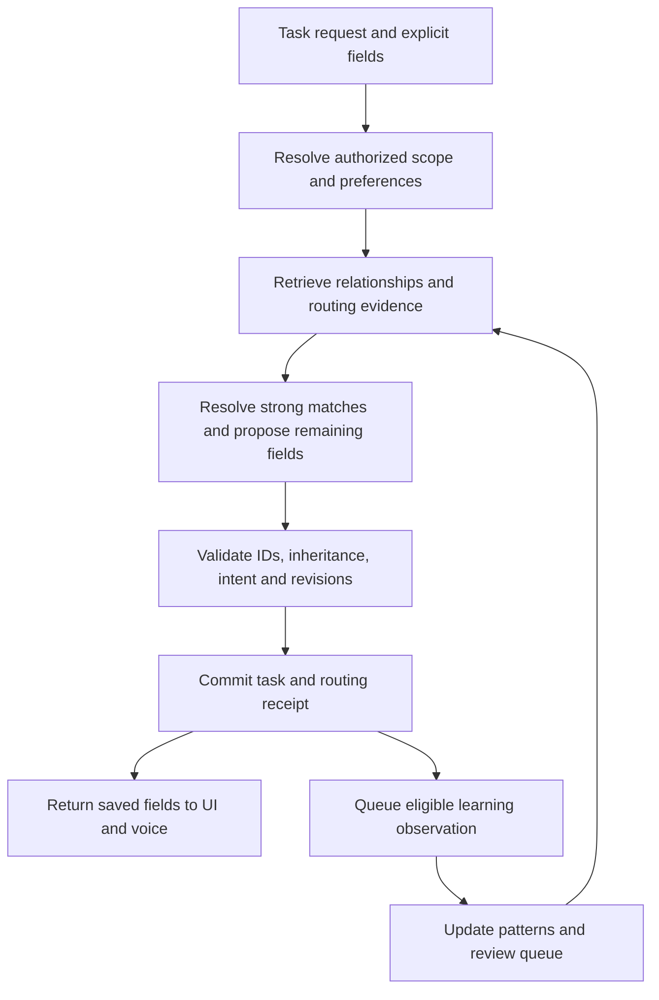

# Eridani task routing and organizational learning PRD

Status: **Product decisions agreed; implementation parked until after cloud migration.**
Date: September 15, 2026.
This request changes documentation only. No task, space, memory, setting, prompt,
database schema or deployed routing behavior has been changed.

## 1. Product outcome

Capture tasks naturally and have Eridani fill in their organizational home when
there is enough evidence. Improve through deliberate choices and corrections,
explain assumptions, and support people whose work differs from software consulting.

For Davis, the intended structure is:

- **Space: Work** — rename the existing Business space, preserving its ID.
- **Client: ABC** — a reusable classification value.
- **Projects: Andi and Transcript Intelligence** — separate initiatives under ABC in Work.
- **Tasks:** may belong to a project, directly to a client without a project,
  only to a space, or remain unfiled.

These are owner-provided requirements for eventual setup, not claims that these
records were inspected or created during this planning request.

Once those relationships and vocabulary are established:

- “Finish the Andi central docs” → Work / ABC / Andi.
- “Update ABC CSRs” → Work / ABC; leave project empty unless evidence identifies it.
- “Refine Transcript Intelligence's evaluation” → Work / ABC / Transcript Intelligence.
- “Buy cat food” at 10 a.m. → Personal when subject evidence supports it.
- “Finish the Andi central docs” at 9 p.m. → the same Work / ABC / Andi route.

Capture time is a weak contextual signal, never a Work/Personal rule.

## 2. Agreed product decisions

The owner confirmed these choices on September 15:

1. **Automatically apply strong matches** with easy correction; leave uncertain
   fields unassigned.
2. **Customizable classification fields**, with Client configured for Davis.
   Other users can use Course, Department, Property or Customer.
3. **One client per project**, inherited by its tasks; standalone client tasks
   are supported. Multiple clients per project/task are outside the first release.

Additional proposed defaults:

- For Davis: 08:00–17:00, Monday–Friday, America/Chicago. The hours are owner-stated;
  weekdays are a draft assumption. All are editable; allow split/overnight shifts
  and multiple work contexts.
- Retained historical tasks supply candidate evidence through a preview, without
  silently reorganizing the existing collection.
- A correction fixes the task now. “Always use this” promotes a reusable mapping;
  “just this task” records an exception.
- Implementation follows migration, starting with deterministic relationships and
  evaluation before automatic semantic routing.

The defaults above remain implementation proposals, not additional owner-confirmed
requirements. The three product decisions are settled; implementation stays parked.

## 3. What the current app already does

The current app is FastAPI/React/PostgreSQL under apps/api/jarvis and apps/web.
The original upgrade PRD's Mem0/Qdrant descriptions refer to historical code.

### Memory context reaches the conversational backend

Yes: [conversation.py](../apps/api/jarvis/conversation.py) calls prompt_context
before the first backend model request, then assembles instructions, retrieved
facts and history. This includes task work delegated by Live and both supported
backend providers.

[memory_service.py](../apps/api/jarvis/memory_service.py) retrieves up to six
relevant facts with source references, using lexical matching and embedding
similarity. It rechecks canonical revisions and source deletion after the
provider wait. Currently the labeled memory data is appended to the system
message. New routing context should use a separate structured data channel,
rather than expanding that system message with raw task text.

Shared-workspace conversations omit private personal memory. The
[access layer](../apps/api/jarvis/access.py) also disables personal history/learning
there. Routing must preserve this boundary.

“Background agent” can mean this conversational backend or durable worker jobs.
The latter do not all receive the same bundle: memory extraction receives its
source and existing facts for deduplication; other jobs have purpose-specific inputs.

### Learning and storage

[memory_learning.py](../apps/api/jarvis/memory_learning.py) extracts explicitly
stated durable personal facts from eligible saved user conversation sources.
It excludes task requests themselves, though stable facts embedded in a request
can qualify. There is no learner over canonical task assignments for routing.

Extraction uses GPT-5.6 Luna with low reasoning. OpenAI text-embedding-3-small
produces 512-dimensional embeddings. Canonical memories and note embeddings are
stored in PostgreSQL. Memory vectors are JSONB and similarity is calculated in
application code; a pgvector index remains planned. Mem0 and Qdrant are not
required for this proposal.

[live_voice.py](../apps/api/jarvis/live_voice.py) also sends bounded relevant-memory
refreshes to Live, separately from retrieval before delegated backend work.

### Organization

The [productivity schema](PRODUCTIVITY_SCHEMA.md) already has spaces, areas,
projects, goals, tasks and informal tags. A selected project determines its task's
space/area, enforced in [productivity.py](../apps/api/jarvis/productivity.py).
There is no first-class Client field or routing-rule store.

A **workspace** is an access boundary. A **space** organizes records within an
allowed scope. Routing between Work and Personal does not authorize moving
anything between private and shared workspaces.

## 4. Organization and customization

Retain existing concepts:

- Space: broad context, such as Work, Personal, School or Volunteering.
- Area: ongoing responsibility, such as Operations or Health.
- Project: finite initiative.
- Client or another configured field: classification shared by multiple projects
  and standalone tasks.
- Ordinary tags: informal labels, not authoritative routing instructions.

Introduce a small classification-field system, initially single-select fields
with managed values, descriptions, aliases and stable IDs. Do not build a general
CRM or unrestricted custom database designer.

For Davis, configure Client in Work, add ABC, and associate the Andi and Transcript
Intelligence projects with ABC. Approved vocabulary can include “ABC CSRs.”
Aliases must respect word boundaries and context; a substring match is insufficient.

Other configurations should need no code changes:

- Student: School / Course = Biology / project = Lab report.
- Property manager: Work / Property = Oak Street / project = Renovation.
- Employee: Work / Department = Operations, without a client field.
- Freelancer: Employer Work and Freelance as separate spaces with their own
  descriptions and optional working windows.

Do not hard-code Davis, ABC, Work, Personal or “client” into classification logic.
Templates can prefill useful labels; users can rename, disable or add dimensions.

### Inheritance and consistency

Project remains authoritative for space/area. Under the agreed single-client
model, its tasks inherit its client; standalone tasks may choose a client directly.
A conflicting client/project selection explains the conflict instead of silently
changing the project.

An omitted field differs from an explicit “no client/project.” Respect deliberately
cleared fields. Removing a project to permit a different home must make that
consequence clear.

Record whether values are explicit or inherited. While a task has a project with
a client, that project is authoritative for Client. When attaching a standalone
task with a different explicit client, resolve the conflict before attachment.
Changing a project's client previews affected inherited tasks before applying;
it never rewrites unrelated standalone tasks. Other configurable fields can opt
into inheritance separately. If inherited values are materialized for search,
maintain them transactionally or treat them as derived projections, never a second
authority. The schema must not allow two contradictory effective Client values.

Rename Business in place. If Work already exists, resolve that conflict explicitly;
do not merge spaces automatically. New-account templates may use Work while
existing accounts retain their own names.

## 5. Routing policy and uncertainty

Decide independently for space, area, project and each enabled classification.
Knowing the client is ABC does not mean knowing which ABC project applies.

Precedence:

1. Current explicit instruction, manual field selection or deliberate clear.
2. Valid canonical relationships, such as selected project → home/client.
3. Confirmed routing instructions and unambiguous approved aliases.
4. Consistent patterns from independently user-labeled tasks.
5. Subject matter and relevant current conversation context.
6. Capture time relative to that person's configured work windows.

Contradictory explicit instructions and project relationships require resolution.
Lower-priority evidence must not resolve an invalid combination silently.
A reusable rule never defeats the user's explicit instruction for this task.

Time alone cannot qualify a route for automatic application. Use original capture
time and configured zone, not due date, worker processing time, container time or
inferred location. Retries retain the same decision inputs. Ignore time hints for
imports lacking trustworthy capture context.

Recommended behavior: apply strong fields and suggest uncertain ones. Explain
with short reasons such as “From Andi project” or “Based on previous ABC tasks.”
Offer “Why?” and a quick correction.

If home is unknown, save unfiled in the current Inbox. A task already placed in
Work with an unknown client does not match Inbox's existing unfiled definition;
offer an optional “Needs routing” filter for such partial results rather than
silently redefining Inbox.

Never fabricate or silently create a project/client/value to fit a task. Offer
creation when the user names an unknown entity. Capture must succeed without
waiting indefinitely for classification.

Routing changes organizational fields only: not status, assignee, priority,
dates, reminders, remote sync destination or authorization to start agent work.

## 6. Separate task-routing knowledge

Add **Memories → Task routing**, with its own retrieval, review and controls.
Reuse hosting, jobs, embedding utilities and UI patterns, but keep routing records
logically separate from personal-memory assertions.

Show three categories:

- **Relationships:** canonical links and explicit declarations, such as Andi →
  ABC. Link to the authoritative project/field instead of copying it into prose.
- **Learned patterns:** supported vocabulary/associations, with examples,
  exceptions and state.
- **Corrections:** what changed and whether it applies once or in future.

Each entry retains scope, source task/message and revision, structured association,
origin, evidence, last validation, status and suppression state. Useful states:
candidate, active, disputed, disabled, superseded. A model's self-reported confidence
is not a calibrated probability.

### Learning without reinforcing guesses

Eligible evidence:

- Explicit organizational statements.
- Manual task/project/classification selections.
- Accepted suggestions and corrections.
- Historical labeled tasks with known origin and authorized scope.

Not independent confirmation:

- Automatic assignments that simply went uncorrected.
- Recurring clones or duplicated imports.
- Eri repeating her own suggestion.
- Repeated sync refreshes of the same remote issue.

An explicit mapping can become active immediately within authorized scope.
One ordinary labeled task is an example, not a universal rule. Repeated consistent
independent examples can promote a pattern only under an evaluated policy;
conflicts pause promotion.

Setting an Andi task to Work / ABC provides an example. Setting the Andi project's
Client to ABC supplies the stronger canonical relationship. Retrieve that link
rather than inferring it afresh each turn.

A correction changes future retrieval immediately. “Only this task” does not
rewrite the global relationship. “Always use ABC for Andi” updates the reusable
mapping subject to project constraints and permissions. Similar spellings with
competing targets enter review instead of automatic entity merging.

Learning never silently reclassifies old tasks. Offer a bounded preview of affected
IDs/revisions, then apply only the selected changes.

### Isolation, forgetting and review

Routing retrieval excludes general personal memory by default. General personal
memory retrieval excludes routing patterns. Questions about task organization or
ABC projects can deliberately use routing/project tools.

A future extraction dispatcher should put task-routing relationships here instead
of also creating personal-memory copies. General job facts may still belong in
personal memory, but cannot become authoritative task mappings without explicit
promotion or supported task evidence.

Separate “learn new patterns” from “use existing patterns.” Private/no-learning
capture must not generate reusable observations.

“Forget” suppresses the association and its derived index entries so backfill does
not immediately recreate it. Disable retains the rule visibly. Source deletion
removes derived content and recalculates support; a user-pinned mapping is an
independent explicit assertion with its own lifecycle.

Weekly review can reuse the scheduler, but has its own routing job and review queue,
separate from personal-memory deep sleep. It flags conflicts, duplicates and weak
support; it does not merge clients/projects merely because names resemble each other.

## 7. Settings and task experience

**Settings → Task routing**

- Off / Suggest / Automatic and uncertain-case behavior.
- Eligible fields and excluded/locked fields.
- Work contexts, descriptions, workdays and editable intervals.
- Time zone and a switch to ignore time of day.
- Classification labels, values, aliases and project inheritance.
- Learn from future tasks, preview historical learning, pause learning.
- Per-space/project exclusions.
- Review, correct, disable, forget and export routing knowledge.

Avoid numeric confidence sliders initially. Use understandable modes and a dry-run
box: “Where would this task go?”

Keep classification compact beside existing task attribution. A subtle indicator
on inferred fields opens the reason and correction choices. No mandatory new
capture screen. Tasks with unresolved fields remain visible; uncertainty must not
turn into repeated voice questions.

For voice, “Added under Work, ABC, in Andi” is appropriate only after the committed
receipt contains those assignments. Do not narrate every inference or wait for
asynchronous learning before confirming the saved task.

## 8. Implementation proposal

This section is a proposed design, not delivered code.

### Data responsibilities

Use PostgreSQL and ordinary migrations. Keep these responsibilities separate:

1. Classification definitions/values: IDs, scope, labels, aliases, allowed spaces,
   revisions and archive state.
2. Task/project assignments: foreign keys, explicit/inherited provenance and
   cardinality. Prefer typed task/project join tables to unchecked polymorphic
   IDs; validate that targets are in the same authorized scope.
3. Routing patterns: bounded typed conditions, allowed target fields/IDs, state,
   versions and provenance. No executable rules or arbitrary SQL.
4. Observations: source/revision, actor, manual/imported/inferred origin,
   positive/negative evidence and lineage for deduplication.
5. Decisions: request/task reference, policy/model/input versions, evidence IDs,
   per-field outcomes, concise reason codes and corrections. Reuse command
   receipt/audit infrastructure where it meets these requirements.

Extend existing preferences for settings. Hours belong to a person; shared field
definitions and canonical mappings belong to their workspace. One member's hours
must not become a team-wide rule.

Embeddings remain derived and optional. Begin with canonical joins, aliases and
lexical retrieval over bounded examples; use the existing cloud embedding service
for semantic candidates when valuable. A later pgvector index filters this
namespace and authorized scope before ranking.

No new vector database, Mem0 adoption, model fine-tuning or autonomous agent runtime
is required. “Learning” here means better stored relationships/evidence and retrieval,
not changing model weights.

### Request flow

For chat/voice capture, assemble a compact typed routing bundle before the backend
chooses task arguments. Reuse the configured Luna/Gemini provider adapter. Deeper
routing tools load on demand; do not send the entire rule library every turn.

The bundle contains allowed IDs, relationships, patterns and evidence references.
Task titles/notes remain untrusted data, not privileged instructions. Constrain
model output and validate it in application code.

All entry points share the policy contract: Live delegation, text, forms,
note-to-task extraction and future API clients. Explicit form selections win.
Deterministic form suggestions can run immediately; optional model suggestions
must not overwrite typing or prevent capture.

Provider calls run outside database transactions. After awaits, revalidate scope,
entity state, settings and revisions. Commit assignments with the task so UI/voice
see one coherent receipt. On timeout, save permitted explicit fields and identify
unresolved routing.

For edits, reconsider only missing or explicitly requested fields when task meaning
changes or the user requests rerouting. Reads, due-date edits and worker activity
do not trigger unsolicited reclassification.

Persist provenance with the command and enqueue through the existing transactional
outbox/DBOS path. Retries cannot double-count evidence, resurrect forgotten
patterns or overwrite later user corrections.

### Integrations and multi-user behavior

Imports preserve explicit source mappings. Treat unverified imported text as weaker
candidate evidence. Client fields remain local until an explicit external mapping
exists; routing must not silently write new Linear projects/teams or Google events.

Stay in the current authorized workspace. Shared routing is opt-in and obeys
owner/editor/viewer permissions. Do not promote private examples to shared evidence.
Initially, shared workspaces can use explicit shared mappings while learned
patterns remain personal until shared-learning controls are validated.

Revocation, workspace switches and source deletion invalidate pending/retrieved
context. Viewers can inspect permitted explanations but cannot mutate tasks,
shared field definitions or rules.

## 9. Rollout and rollback

After migration:

1. Add classification fields and canonical inheritance; configure Davis's Work /
   ABC relationships in a reviewable setup.
2. Add separate routing storage and manual correction/rule controls.
3. Preview historical evidence; unknown-origin records cannot count as strong labels.
4. Run shadow evaluation without changing assignments.
5. Choose conservative per-field thresholds from evaluation.
6. Enable suggestions, then optional automatic routing.
7. Add weekly routing review and semantic/vector improvements when justified.

Rollback independently disables inference and learning. Existing task assignments
and explicit relationships stay usable. Routing failure cannot stop task capture
or reminders. No automatic bulk reassignment during rollout or rollback.

## 10. Acceptance and evaluation

Use owner-reviewed expected outcomes and legitimate abstentions. Hold out examples
by task family/time; recurring duplicates must not appear on both sides.

Required cases:

1. Andi routes to Work / ABC / Andi inside and outside work hours.
2. ABC CSR routes to Work / ABC without guessing a project.
3. Personal errand stays Personal during work hours.
4. Ambiguous “finish the docs” remains partly/unassigned unless explicit current
   context identifies the project.
5. “Dinner with Andi” is not forced into work based only on the name.
6. Duplicate aliases in different contexts cause abstention or clarification.
7. Explicit Personal defeats time hints; conflicting project home is handled visibly.
8. One-off corrections do not rewrite universal mappings.
9. Auto-assigned tasks, recurring clones and sync repeats do not reinforce themselves.
10. Rename preserves identity; archived targets and stale suggestions cannot be applied.
11. Forgetting, source deletion, private capture and paused learning work during
    in-flight model requests as well as ordinary processing.
12. No cross-user or private-to-shared leakage.
13. Shift, weekend, DST, zone changes and delayed processing respect capture context.
14. Model/embedding failures still save explicit task fields.
15. Bulk operations, retries and concurrent edits preserve revisions and lineage.
16. Status, dates, reminders and external destinations are unaffected.
17. Course/Property configuration needs no application code change.
18. General-memory and routing retrieval remain separate unless explicitly requested.
19. Spoken confirmations match committed assignments.
20. Project inheritance edits and rerouting previews do not overwrite explicit values.

Proposed release targets, not measured results:

- At least 95% precision for auto-applied fields on at least 100 independent
  reviewed held-out examples. Report sample size, uncertainty and errors per field
  and user; keep model-inferred assignments in shadow/suggestion mode until the
  auto-routing release gate passes, without weakening the agreed eventual default.
- Report coverage and abstention separately from precision.
- All deterministic intent, authorization, inheritance and concurrency checks pass.
- Measure correction rate, reason correctness, retrieval success, model-call count
  and added capture latency. Aim for p95 routing overhead below two seconds, with a
  bounded fallback if this cannot be met.
- Compare time-aware and time-disabled routing to show whether time actually helps.

No routing benchmark has been run. Development cost recording stays disabled;
latency/call-count measurements do not require restarting the cost ledger.
Langfuse is optional.

## 11. Migration sequencing

This PRD is not a dependency for cloud cutover. Finish discussion, park
implementation, and resume the [cloud migration runbook](CLOUD_MIGRATION.md).

Keep PostgreSQL authoritative with the existing PITR/backup plan. Routing records
and a vector index can be added after migration through ordinary schema changes.
Do not add a second database/service during cutover for this feature.

Section 2 records the owner's answers; engineering details remain proposed. This
documentation-only request
does not rename Business, seed ABC/projects, index tasks or change model prompts.

## 12. Sources and rationale

Repository observations use the current linked files, not prototype descriptions.

OpenAI's [retrieval guide](https://developers.openai.com/api/docs/guides/retrieval)
describes semantic search and attribute filtering before search. That supports
scoped candidate retrieval as a technique. PostgreSQL and separate routing records
are our architectural choices, not an OpenAI requirement.

OpenAI's [agent safety guidance](https://developers.openai.com/api/docs/guides/agent-builder-safety)
recommends isolating untrusted inputs and constraining data flow with structured
outputs. Apply those principles to task text and candidates; schema validation
cannot establish that a semantic classification is correct.
