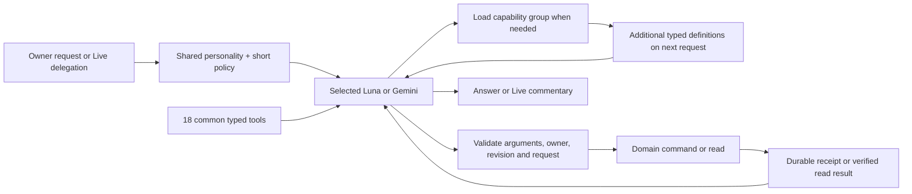

# Tool interface revision — September 13, 2026

The implementation follows official provider guidance, with a shared portable
discovery mechanism so Luna and Gemini see the same app capabilities.

- Use a short global operating policy; move detailed prerequisites, side effects,
  provenance, error recovery and result semantics into function descriptions and
  parameter schemas. Deferred tools need concise group descriptions and specific
  loaded-function guidance. Use explicit types/enums and move exact filtering and
  counting into application code.
  [OpenAI function calling](https://developers.openai.com/api/docs/guides/function-calling)
- Start with a small active catalog. Tool schemas still consume context even when
  moved out of prose. Grouped discovery actually defers their cost. OpenAI's
  native tool search preserves prompt caching and supports deferred namespaces;
  our portable function-based loader uses the same groups for both providers,
  adds selected schemas on the next model request, and retains loaded tools for
  that turn. It may cost an extra model round and does not inherit the native
  tool-search caching guarantee.
  [OpenAI tool search](https://developers.openai.com/api/docs/guides/tools-tool-search)
- Give Gemini specific descriptions and typed parameters, keep the active tool
  set small, and validate every call in application code. Groups are loaded only
  as needed; the initial catalog stays below twenty tools. Complex workflows can
  accumulate more tools as they discover multiple groups.
  [Google function calling](https://ai.google.dev/gemini-api/docs/function-calling)
- Keep GPT-Live's prompt about personality, conversational conduct, backend
  capabilities and delegation. Backend-specific procedures and exact tool
  parameters belong behind the delegation boundary.
  [GPT-Live prompting](https://developers.openai.com/api/docs/guides/live-prompting)

## Decisions and safeguards

The loader returns tool names and adds actual typed definitions to the next API
request. It is not a generic execute(name, arbitrary JSON) wrapper, and it does
not execute actions during discovery. Per-tool validation, owner checks,
optimistic revisions, idempotent commands and durable integration writes remain
the authority. Integration credentials never enter model context.

Strict mode is used only for schemas whose required fields express the correct
contract and whose keywords fit the supported subset. Unknown keywords remain
non-strict at the provider boundary; server validation still enforces them. Existing sparse updates preserve omission versus explicit null;
blindly making every field required and nullable would turn untouched fields into
clears. They remain explicitly non-strict at the provider boundary and strictly
validated by the application. A wholesale patch-format migration is outside this
revision.

Common task edits and record/navigation lookups stay available initially to
avoid mandatory discovery on routine requests across tasks, notes and calendars. Other groups remain discoverable without
guessing user intent with keyword routing. Loading a group adds capabilities;
it does not grant new authorization.

The previous expert traces remain immutable. The completed follow-up uses twenty
selected scenarios, including every earlier failing scenario, with the same
fixtures and three repetitions per model. This is a targeted regression comparison,
not an unbiased estimate of general ability. Actual tool/prompt bytes and provider
usage are recorded in [the results](TOOL_REFINEMENT_RESULTS.md).

## Implemented interface

The initial catalog is eighteen tools: discovery; task list/get/resolve/create/
update/complete; batch/selection updates; time resolution; note search/read;
organization, calendar and memory lookups; and page/record/chat navigation. The complete catalog
contains 81 tools across thirteen groups. Groups contain fewer than ten tools,
with shared read tools intentionally appearing in more than one group.

Descriptions now carry prerequisites, replacement-list behavior, provenance,
recovery and pending-write semantics. Parameter schemas retain sparse updates.
The server validates read arguments as well as command arguments. Unknown or
unloaded calls cannot bypass the loader; tools loaded in a response become
callable on the next model round. Loaded catalogs are local to one backend turn,
including its continuations, not shared across owners or model requests.

Measured with compact UTF-8 JSON, initial schemas fell from 51,310 to 20,833
bytes (59.4%). Global backend instructions fell from 12,789 to 4,532 bytes (64.6%).
The full enriched catalog is 65,096 bytes: descriptions became more complete;
the savings come from deferring them. Live's complete static prompt is 4,298
bytes. These are byte measurements, not provider token counts; dynamic personal
memory, screen context and native reasoning add to actual requests.

## Seven reliability fixes

1. Task filters express exact project/status/assignee/work-type/tag/deadline scope.
   One SQL snapshot returns both the exact count and matching records. Frozen
   owner-scoped selections support up to 1,000 tasks, expire after fifteen minutes,
   and retain compact IDs/revisions/fields. The process cache is capped at sixteen
   MiB and 128 selections. A restart or eviction requires a fresh lookup.
2. Malformed note/task lookup UUIDs return MALFORMED_ID with actionable recovery.
   A valid but inaccessible UUID still returns NOT_FOUND without revealing ownership.
3. Batch/selection receipts include requested, applied and unchanged counts and
   distinct IDs. Duplicate IDs are rejected; stale revisions reject the entire
   batch. Replaying a committed command returns its durable original receipt even
   after a snapshot expires. Model replies receive at most thirty compact task
   previews plus all counts/IDs; the HTTP/durable receipt retains complete data.
4. time_resolve checks gaps, repeated hours and offset/zone mismatches before
   writes. Gap alternatives are actual valid local times, including non-hour
   transitions and skipped days. Choosing a replacement remains the owner's call.
5. Google/Linear status exposes active retry, a recommended polling delay and
   explicit false values for unscheduled notification/assistant follow-up. The
   polling delay is not an exact DBOS retry timestamp.
6. Goal/project edits return added/removed links and affected peers' current
   revisions. Both directions are already updated; a second opposite-side write
   is unnecessary.
7. note_tasks is explicitly the path for note-derived task creation. Its receipt
   proves source note/revision/evidence and separates new from existing tasks;
   exact quote validation and deduplication remain in one write implementation.

## Model retirement

GPT-5.4 mini no longer appears in the runtime catalog or selection UI. Legacy
OpenAI selections resolve to Luna; explicit Gemini selections are preserved.
Luna and Gemini both use low reasoning for backend work. Automatic memory/note
extraction uses Luna Responses with strict structured output and low reasoning,
independent of the selected task model. Synthetic real-provider checks passed
for both extraction paths without saving personal records. The embedding model,
memory extraction version and historical memories are unchanged; this does not
trigger bulk relearning.

Historical 5.4-mini references in earlier experiments and the original PRD are
retained as history, not runnable production routes. Realtime remains disabled.
Development cost recording remains disabled.

## Provider-compatibility finding during verification

An initial scored attempt exposed ui_select's uniqueItems constraint, which Luna
rejects in strict mode. The original required-field-only compatibility test was
insufficient. The final adapter checks a conservative supported keyword subset;
ui_select is non-strict at the provider boundary and still rejects duplicates in
the server. A real schema-only request with all 81 tools then returned HTTP 200
from both providers. The interrupted attempt is retained and excluded from the
fresh complete paired run, including its genuine planning finding. No baseline
question or state oracle was changed to accommodate model behavior.

## Discovery refinement during development

The first ten-tool catalog emphasized tasks. A partial paired run then exposed
missed note edits and record navigation. Review also found a stale ui_show
parameter description that named tasks/schedules but omitted notes and organize
records. The final eighteen-tool catalog keeps common cross-record reads and
navigation immediately available, while specialized mutations remain deferred.
Descriptions now distinguish reading note content from opening that note on
screen, and a record-open request needs its entity_id. These observations motivate
the change; they do not prove the first catalog alone caused every missed action.

Calendar tool contracts now also explain local-only availability and the minimum
free-slot filter, and clarify that calendar_update is a full event-field
replacement. Callers copy current unrequested fields rather than assuming sparse
patch semantics. A requested status verification is distinct from repeated rapid
polling. The final evaluation follows these fixes; earlier attempts remain
development evidence, not independent held-out validation.

